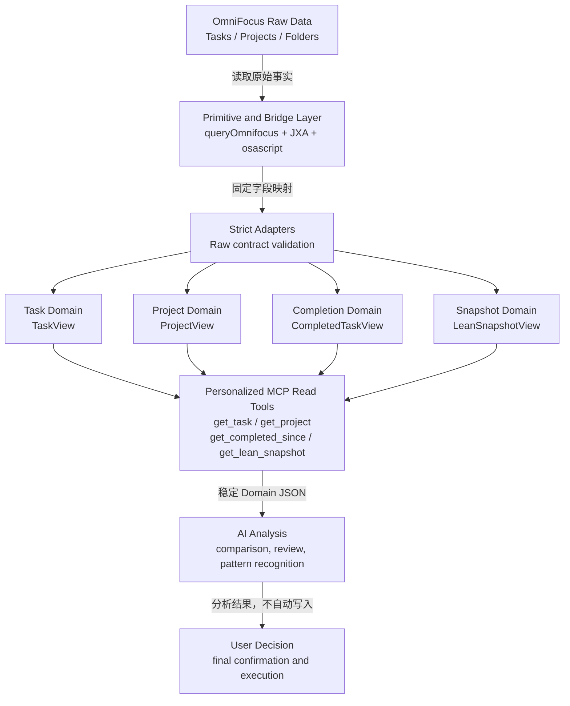

# OmniFocus-Agent-MCP v1.0-personalized

基于 upstream OmniFocus MCP `v1.9.2` 构建的个人管理语义层，用于向 GPT 和其他 MCP 客户端提供稳定、只读优先的 OmniFocus Domain View。

> Release status: `v1.0-personalized` — current frozen personalized architecture

## 1. Overview

本项目最初提供 OmniFocus 数据访问、通用查询和对象操作能力。个人化版本在该基础上增加了明确的 Domain Semantic Layer，使 AI 不必直接解释 OmniFocus Raw Object、继承日期或 Project root 的底层表示。

当前架构目标是：

```text
OmniFocus
    ↓
Domain Semantic Model
    ↓
MCP Tools
    ↓
AI Analysis
```

该版本的目标不是让 AI 自动管理任务，也不是让模型替用户做出执行决策，而是提供可验证、来源明确、结构稳定的事实视图，辅助用户分析个人执行系统。

核心原则：

- 默认只读：个性化工作流以读取和分析为默认模式。
- 事实先于解释：Domain 层表达 OmniFocus facts，不生成健康度、风险、优先级或行动建议。
- AI 负责分析：AI 可以归纳、比较和识别模式，但不自动修改 OmniFocus。
- 用户最终决策：任何确认、调整和执行都由用户本人控制。

### Version identity

| 项目 | 当前值 |
|---|---|
| 个性化版本 | `v1.0-personalized` |
| Upstream 基础版本 | `v1.9.2` |
| MCP transport | stdio |
| 运行平台 | macOS + OmniFocus |
| 个性化核心接口 | `get_task`、`get_project`、`get_completed_since`、`get_lean_snapshot` |

`v1.0-personalized` 是个性化语义层的 release label；npm/package 基础版本仍保留 upstream `1.9.2`。

---

## 2. v1.0-personalized Release Notes

`v1.0-personalized` 是当前已冻结的个人化架构基线。后续评审和演进应以本版本已经建立的 Domain Contract 和语义规则为起点。

### Completed

#### Task Domain

- 严格的 Raw Task Adapter。
- 稳定的 `TaskView`。
- `action`、`action_group`、`project_root` 三种 `TaskKind`。
- Due、Planned、Defer 的 direct/effective/source 表达。
- Completion、Drop、Flag 的 direct/inherited/none 表达。

#### Project Domain

- 严格的 Raw Project Adapter。
- 稳定的 `ProjectView`。
- canonical Project ID。
- standard 与 single-actions Project 分类。
- Folder、状态、Task aggregate 和日期语义。

#### Completion Domain

- 稳定的 `CompletedTaskView`。
- 基于 direct `completionDate` 的完成事件流。
- 明确排除 Project root completion event。
- 支持 Action 与 Action Group completion。

#### Lean Snapshot Domain

- 稳定的 `LeanSnapshotView`。
- Active Projects、Planned Projects、Project Deadlines、Attention 和 Inbox sections。
- Project 与 root Task 的 canonical join。
- 完整计数、确定性排序和独立截断。

#### Planned Attention Semantics

- Direct Planned owner 产生 Planned visibility。
- inherited Planned facts 被保留，但不会生成重复 Attention。
- Project-level Planned owner 进入独立的 `projects.planned` section。

#### Due Attention Semantics

- Direct Due owner 产生 deadline signal。
- inherited Due facts 被保留，但不会生成重复 `dueSoon` 或 `overdue` Attention。
- Project-level Due owner 进入独立的 `projects.deadline` section。

#### MCP read tools

- `get_task`
- `get_project`
- `get_completed_since`
- `get_lean_snapshot`

这四个 Tool 返回稳定 Domain JSON，而不是把通用查询结果直接暴露给 AI。

### Frozen Design Principles

#### Domain-first architecture

个性化功能首先定义 Domain Contract，再定义 Tool 输出。MCP handler 不承担核心业务语义。

```text
Raw Query
    -> Strict Adapter
    -> Domain Semantics
    -> Mapper / Composer
    -> MCP Response
```

#### Semantic projection

Domain View 是对 OmniFocus facts 的明确投影，而不是 Raw Object dump。字段被固定选择、验证和解释，内部 Raw contract 不直接公开。

#### Direct ownership of management signals

Planned 和 Due 信号按 direct owner 粒度表达。容器继承产生的 effective value 是事实，但不是新的管理信号 owner。

#### Separation of fact and interpretation

Domain 层负责表达：

- 对象是什么。
- 值来自对象自身还是容器继承。
- 当前 OmniFocus native status 是什么。
- 对象之间的结构关系是什么。

Domain 层不负责表达：

- 应该先做什么。
- Project 是否健康。
- 哪个对象风险最高。
- 用户应该采取什么行动。

这些解释属于 AI Analysis 和用户决策层。

---

## 3. Architecture Overview



主要实现路径：

```text
src/tools/primitives/queryOmnifocus.ts
    ↓
src/domain/{task,project,completion,snapshot}/
    ↓
src/tools/primitives/get*.ts
    ↓
src/tools/definitions/get*.ts
    ↓
src/server.ts
```

### Layer responsibilities

| Layer | 职责 |
|---|---|
| OmniFocus Raw Data | 提供 Task、Project、Folder、日期、状态和层级的原始事实 |
| Primitive / Bridge | 生成并执行只读 OmniJS 查询，映射固定字段和 canonical ID |
| Adapter | 严格校验 Raw item；不静默修复 malformed values |
| Domain | 分类、保留来源语义并构建稳定 View |
| Snapshot Composer | 跨 Task/Project 组合当前系统状态 |
| MCP Tool | 参数校验、稳定响应和错误分类 |
| AI Analysis | 基于事实进行解释，不承担事实生成和自动写入 |

---

## 4. Domain Model

### Task Domain

Task Domain 位于 `src/domain/task/`，对外读模型是 `TaskView`。

`TaskView` 包含：

- identity：`id`、`name`、`note`
- `TaskKind`
- native Task status
- completion、drop、flag semantics
- Due、Planned、Defer semantics
- Project context 与 Inbox location
- hierarchy、tags、repeat、estimate 和 timestamps

#### TaskKind

```ts
type TaskKind = "action" | "action_group" | "project_root";
```

分类规则：

```text
isProjectRoot = true  -> project_root
否则 hasChildren      -> action_group
否则                  -> action
```

- `action`：没有 children 的普通执行项。
- `action_group`：有 children、但不是 Project root 的 Task。
- `project_root`：OmniFocus Project 的 root Task 表示。

Action 当前属于 Task Domain，不是独立 Domain。当前代码没有独立 `ActionView`、Action aggregate 或 `get_action` Tool。

### Project Domain

Project Domain 位于 `src/domain/project/`，对外读模型是 `ProjectView`。

`ProjectView` 包含：

- canonical Project identity
- Project kind：`standard | single_actions`
- Active、OnHold、Done、Dropped 状态语义
- Folder context
- direct/effective Due 和 Defer
- direct Task IDs、全部 descendant Task IDs 和 native-status counts
- timestamps

#### Project Root semantics

OmniJS Project ID 与 Project root Task ID 属于不同 namespace。个性化 Domain 对外统一使用：

```text
canonical Project ID = project.task.id.primaryKey
```

因此同一个 canonical ID 可以从两个互补视角读取：

```text
get_project(projectId)
    -> Project aggregate、Folder、Project status、Task summary

get_task(projectId)
    -> 对应 project_root Task 的 Task facts
```

Snapshot 使用 canonical ID 将 `RawLeanProject` 与 `isProjectRoot = true` 的 `RawLeanTask` 精确连接。Project 是管理聚合；root Task 是它在 OmniFocus Task 模型中的表示。两者不是重复接口。

### Completion Domain

Completion Domain 位于 `src/domain/completion/`，对外读模型是 `CompletedTaskView`。

`CompletedTaskView` 表达一次直接完成事件：

- Action 或 Action Group identity
- direct `completedDate`
- Project/Inbox context
- tags
- created/modified timestamps

`get_completed_since` 读取 direct `completionDate` 位于指定闭区间内的完成事件，并按完成时间降序返回。

它不会通过以下值推导历史完成：

- `taskStatus`
- `modificationDate`
- `effectiveCompletedDate`

Project root completion event 被排除，Action Group completion 被保留。Completion Domain 是未来 Review Workflow、完成回顾和趋势分析的事实基础，但当前不自动生成 Review 结论。

### Snapshot Domain

Snapshot Domain 位于 `src/domain/snapshot/`，对外读模型是 `LeanSnapshotView`。

```text
LeanSnapshotView
├── generatedAt
├── scope = all
├── projects
│   ├── active
│   ├── planned
│   └── deadline
├── attention
└── inbox
```

每个 list section 均提供：

```text
total
returned
truncated
items
```

Lean Snapshot 不是完整数据库导出。它只读取当前 remaining Tasks 和 Active Projects，并输出当前管理视角需要的 compact facts：

- 不读取 note 全文，只输出 `hasNote`。
- 不包含完成历史；完成历史由 Completion Domain 提供。
- 不包含 Waiting、health、risk、priority 或 recommendation。
- 不展开所有 Project Task details，只保留 Task counts 和 native-status aggregate。
- Project root 在内部用于语义解析，但不进入 Task Attention 或 Inbox。

它也不是普通查询接口。Snapshot Composer 会执行 Project/root join、ownership classification、完整计数、稳定排序和独立截断，从而形成一次性的系统级 current-state read model。

---

## 5. Semantic Rules

### Direct, effective, and source

Domain 日期语义统一表达为：

```ts
{
  direct: string | null;
  effective: string | null;
  source: "direct" | "inherited" | "none";
}
```

- `direct`：值直接设置在当前对象上。
- `effective`：OmniFocus 计算后的实际生效值，可能来自当前对象或上层容器。
- `source = direct`：当前对象直接拥有该值。
- `source = inherited`：当前对象只有从容器继承的 effective value。
- `source = none`：不存在对应事实。

该区分用于保留事实，同时防止把 inherited value 当作新的管理信号。

### Planned Attention

冻结规则：

> Direct Planned owner produces Planned visibility.

对于 Action 和 Action Group，`planned` Attention 需要：

```text
planned.source = direct
AND planned.direct <= generatedAt
AND taskStatus != Blocked
```

对于 Active Project，root Task 的 direct Planned 已到达时，Project 进入 `projects.planned`。

Inherited Planned values：

- 继续保留在 Domain dates 中。
- 不产生独立 `planned` Attention。
- 不把一个 Project-level workflow 展开为多个重复 child signals。

### Due Attention

冻结规则：

> Direct Due owner produces deadline signal.

对于 Action 和 Action Group：

```text
due.source = direct
AND native taskStatus = DueSoon | Overdue
```

对于 Active Project，root Task 直接拥有 Due 且 native status 为 `DueSoon` 或 `Overdue` 时，Project 进入 `projects.deadline`。

Inherited Due values：

- 继续保留在 Domain dates 中。
- 不产生独立 `dueSoon` 或 `overdue` Attention。
- 不因为多个 descendants 继承相同 Due 而产生重复 deadline signals。

系统使用 OmniFocus native `taskStatus` 判断 DueSoon/Overdue，不定义自有 DueSoon 时间窗口。

### Attention aggregation

Attention reasons 的固定顺序为：

```text
overdue -> dueSoon -> planned -> flagged
```

同一 Task 最多出现一次，但可以同时携带多个 reasons。Inbox 和 Attention 是独立 section，因此同一 Task 可以出现在两者中。

---

## 6. Current MCP Tools

本节描述 `v1.0-personalized` 冻结的 Domain read tools。它们不是简单数据查询，而是面向 AI 分析的领域投影。

### `get_task`

按 exact Task ID 或区分大小写的 exact name 读取单个 `TaskView`。

主要用途：

- 区分 action、action_group 和 project_root。
- 检查 direct/effective 日期来源。
- 检查 completion、drop 和 flag provenance。
- 获取 Project context、Inbox location 和 hierarchy。

它查询 OmniFocus Task 实体，但返回的是稳定 Task Domain View，而不是通用 Task query result。

### `get_project`

按 canonical Project ID 或区分大小写的 exact name 读取单个 `ProjectView`。

主要用途：

- 获取 Project status、kind 和 Folder context。
- 查看 direct/all Task relationships 和 native-status counts。
- 查看 Project Due/Defer provenance。
- 使用统一 canonical ID 连接 Project 和 root Task 视角。

它表达 Project aggregate，不替代选择性 `get_task` 读取。

### `get_completed_since`

读取 `{ since, until? }` 闭区间内的 direct completion events。

主要用途：

- 完成回顾。
- Review Workflow 的事实输入。
- 后续趋势或节奏分析。

`since` 和 `until` 必须是带 `Z` 或明确 UTC offset 的完整 ISO 8601 datetime；`until` 缺省为调用时刻。空结果是正常成功。

### `get_lean_snapshot`

读取当前全系统的 compact `LeanSnapshotView`。

主要用途：

- 查看全部 Active Projects 的摘要。
- 查看已经到达的 direct Planned Project owners。
- 查看 Project-level direct deadline owners。
- 查看 Task-level Attention reasons。
- 查看 Inbox 当前状态。

可选 `limitPerSection` 独立限制各 section，默认 `25`，允许 `1..100`。每个 section 在截断前计算完整 `total`。

### `search_tags`

对既有 OmniFocus Tag 执行结构化只读发现，默认只返回 Active。输出包含 canonical ID、exact
native status、完整 root-to-self path、children 与 mutual-exclusion facts；同名 Tag 必须按
完整 path 消歧。该 Tool 不创建或修改 Tag，结果也不是长期 mutation token；tagged creation 必须
在本次明确意图中以完整 path 确认候选，并只向 `create_task` 提交 canonical IDs。

### Upstream compatibility surface

仓库仍保留 upstream `v1.9.2` 的通用查询、Resource、Perspective、Tag 和 mutation tools。
它们只在显式选择 `upstream-full` 时由 `src/serverRegistration.ts` 注册，不属于
`v1.0-personalized` Domain Contract，也不进入默认 `personal-production` surface。

因此，仓库保留写入实现不等于默认实例可写；当前边界由 Server-side Profile registration
强制，而不是客户端 allowlist。`personal-production` 当前公开五个 read tools（含 `search_tags`）和
唯一受控 mutation `create_task`，且无 Resources；`upstream-full` 只能显式启用。

---

## 7. Current Design Boundaries

`v1.0-personalized` 当前不包含以下能力。

### Full Snapshot MCP

当前只有 Lean Snapshot。仓库中的 `dump_database` 是 upstream raw/full report 能力，不是一个经过稳定 Domain 建模的 Full Snapshot MCP。

### Action independent Domain

Action 与 Action Group 当前属于 Task Domain，通过 `TaskKind` 表达。不存在独立 Action Domain、`ActionView` 或 `get_action`。

### AI automatic decision making

Domain Tool 不判断优先级、风险、健康度或“下一步应该做什么”。AI 分析结果不等于系统决策。

### OmniFocus write automation

自动写入不是个性化架构的一部分。当前个性化 workflow 不会根据 Snapshot 或 AI 分析自动创建、编辑、完成或删除 OmniFocus 对象；`create_task` V3 仅响应用户新的、明确的单个 Inbox 或 exact Active Project Task 创建请求，并可选接受 1–5 个 freshly-discovered、明确确认、ancestor-active 的既有 Tag canonical IDs。Tag 子路径由独立 feature flag 默认关闭，绝不按名称解析或自动创建 Tag。

Upstream mutation tools 仍存在于仓库中，但不属于个性化默认操作路径。

这些边界是当前冻结范围，不代表对应方向已经确定实现。

---

## 8. Future Roadmap

### Future Phase

未来评审可能考虑：

- Full Snapshot：在明确 Contract 和体积边界后，提供比 Lean Snapshot 更完整的 Domain read model。
- AI Review Workflow：组合 Snapshot 和 Completion facts，支持结构化回顾流程。
- Better semantic analysis：在不污染事实层的前提下，增强对执行系统模式的分析。

未来演进应继续保持：

- Raw facts 与解释分离。
- direct ownership 语义稳定。
- 写入行为不由分析结果自动触发。
- 新概念先定义 Domain boundary，再决定是否增加 MCP Tool。

---

## 9. Safety Model

### Default personal production profile

`personal-production` 是面向日常 ChatGPT App 的精选生产能力集合。当前精确接口为：

```text
get_task
get_project
get_completed_since
get_lean_snapshot
search_tags
create_task
```

前五个是稳定 read tools；`create_task` 是唯一受 feature flag、显式授权和幂等保护约束的 mutation。该 Profile 不注册 Resources。

### No automatic OmniFocus mutation

Snapshot、Attention 和 Completion 结果只作为分析输入，不会自动触发 OmniFocus 写入。AI 不应根据分析结果自行调用创建、编辑、完成、移动或删除操作。

### User retains final control

系统责任边界是：

```text
OmniFocus 提供事实
    ↓
Domain Layer 解释事实来源和结构
    ↓
AI 分析事实
    ↓
用户确认、决策并执行
```

用户始终保持最终控制权。

### Deployment profiles

ChatGPT Developer App、ChatGPT Web / iPhone 和 Secure MCP Tunnel 当前使用：

```bash
OMNIFOCUS_MCP_PROFILE=personal-production
```

该 Profile 当前在 Server capability registration 层只公开 `get_lean_snapshot`、
`get_project`、`get_task`、`get_completed_since`、`search_tags` 和 `create_task`，不注册 generic read tools、
其他 mutation tools 或 MCP Resources。因此当前能力边界不依赖客户端 Tool allowlist。
`create_task` V3 只允许显式创建单个 Inbox 或 exact Active Project Task，可选添加 1–5 个既有
Active Tag canonical IDs；不能从 Profile 名称或该 Tool 推断、自动获得任何其他写入能力。
V3 build、ChatGPT App Refresh、禁写客户端门禁、两条真实 Canary 与 T2-E 正式启用均已通过。
当前 loaded flags 为 global=`true`、Project=`true`、Tag=`true`；tagged creation 仍必须使用 fresh
`search_tags` canonical IDs，并通过写前 Active ancestor、去重和互斥验证。

T2-D tagged Inbox 与 tagged Project Canary 均已通过一次性隔离进程完成单次创建、服务器侧
exact ID-set/placement 验证、用户人工确认/删除与 ID/name 双 `not_found`；Project 计数恢复到
创建前值，Tag projection、Ledger/audit/lock 终检通过。公开 Tunnel 在 T2-D 期间始终保持
Tag flag=`false`；T2-E 随后按 fail-closed reload 正式启用，配置过程零 mutation。

环境变量未设置或为空时安全默认进入 `personal-production`。`upstream-full` 只能通过
`OMNIFOCUS_MCP_PROFILE=upstream-full` 显式启用；完整模式继续注册仓库现有的全部 Tool
和 Resources，包括 mutation tools，不作为日常 ChatGPT App 默认 Profile。任何其他
Profile 值（包括旧的 `personal-readonly`）都会在 Server connect 前导致启动失败，并列出允许值。

---

## Maintenance Reference

当前 Domain 设计与冻结语义主要位于：

```text
src/domain/task/
src/domain/project/
src/domain/completion/
src/domain/snapshot/

engineer_log/GET_TASK_ENGINEERING_LOG.md
engineer_log/GET_PROJECT_ENGINEERING_LOG.md
engineer_log/GET_COMPLETED_SINCE_ENGINEERING_LOG.md
engineer_log/GET_LEAN_SNAPSHOT_ENGINEERING_LOG.md
engineer_log/GET_LEAN_SNAPSHOT_PLANNED_CORRECTION_ENGINEERING_LOG.md
engineer_log/GET_LEAN_SNAPSHOT_DUE_ATTENTION_GRANULARITY_ENGINEERING_LOG.md
```

后续维护者和 AI Agent 应优先以类型定义、Domain tests 和工程日志中的冻结规则判断当前行为，不应从通用 Tool 文案推断 Domain semantics。

- [项目文档导航](./docs/README.md)
- [Domain Tool 开发规范](./docs/DEVELOPMENT.md)
- [Tunnel 日常维护与 Tool 发布手册](./tunnel/docs/OmniFocus-MCP-Tunnel日常维护与新增Tool操作手册.md)
- [v1 个性化实现与验收历史](./docs/history/personalization-v1-implementation-and-acceptance.md)

## License

MIT
