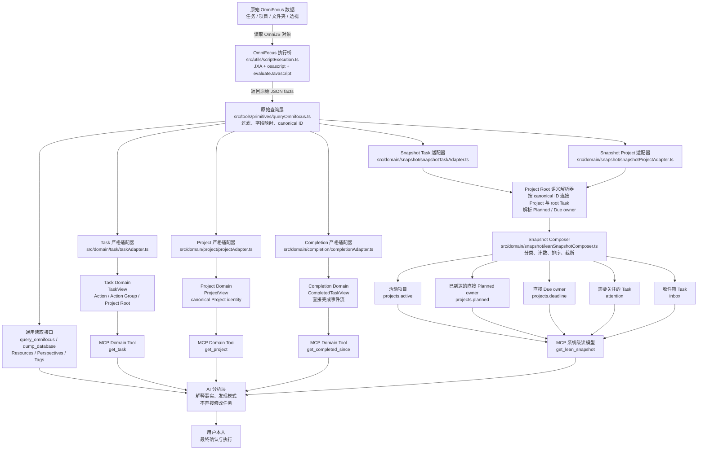

# OmniFocus-Agent-MCP Architecture Audit

## 1. Overview

本报告审计当前仓库静态架构。审计基准为 `main` 分支提交
`1af4a332055716378a41a01f9dcf8f648e230dec`。

当前仓库不是一个纯粹的“OmniFocus 查询 MCP”，而是两代架构并存：

1. 通用集成层：直接提供查询、Resource、Perspective、Tag 和写入能力，输出以人类可读文本或通用字段为主。
2. Domain Semantic Layer：由 `get_task`、`get_project`、`get_completed_since`、`get_lean_snapshot` 四个稳定 JSON Tool 构成，通过严格 Adapter、语义分类器和 Mapper，把 OmniFocus Raw facts 转换为面向 AI 的 Domain View。

当前主数据路径是：

```text
OmniFocus / OmniJS
    -> queryOmnifocus primitive
    -> strict adapter
    -> Raw Domain facts
    -> semantic classifier / resolver
    -> Domain View / Snapshot Composer
    -> MCP JSON response
    -> AI analysis
```

核心判断：

- 底层核心实体仍然是 OmniFocus `Task` 和 `Project`。
- `Action`、`Action Group`、`Project Root` 已作为 Task 的语义分类存在，但没有独立 Action Domain。
- `Snapshot` 是当前最高层的系统级读模型。
- `Owner` 不是显式实体，但 direct Planned/Due owner 已成为 Snapshot 的关键业务原则。
- “OmniFocus 默认只读”尚未由 Server 强制执行。`src/server.ts` 当前仍注册 7 个写入 Tool；只读性依赖客户端隐藏、使用约束或部署配置。

---

## 2. Repository Structure

### 2.1 根目录

```text
.
├── assets/
│   └── omnifocus-mcp-logo.png
├── docs/
│   └── Architecture_Audit.md
├── engineer_log/
│   ├── GET_TASK_ENGINEERING_LOG.md
│   ├── GET_PROJECT_ENGINEERING_LOG.md
│   ├── GET_COMPLETED_SINCE_ENGINEERING_LOG.md
│   ├── GET_LEAN_SNAPSHOT_ENGINEERING_LOG.md
│   ├── GET_LEAN_SNAPSHOT_PLANNED_CORRECTION_ENGINEERING_LOG.md
│   └── GET_LEAN_SNAPSHOT_DUE_ATTENTION_GRANULARITY_ENGINEERING_LOG.md
├── src/
├── cli.cjs
├── package.json
├── package-lock.json
├── tsconfig.json
├── vitest.config.ts
├── vitest.integration.config.ts
├── README.md
├── PERSONALIZATION.md
├── QUERY_TOOL_REFERENCE.md
├── QUERY_TOOL_EXAMPLES.md
└── LICENSE
```

主要职责：

- `src/`：服务器、Domain、Tool、Resource、Bridge 和测试实现。
- `engineer_log/`：Domain Tool 的设计决策、冻结语义和验收记录。
- `docs/`：面向后续架构评审的说明文档。
- `assets/`：项目静态资产。
- `cli.cjs`：CLI 启动入口。
- `package.json`：构建、测试、启动及发布配置。
- `README.md`、查询文档：面向使用者的通用 MCP 能力说明。

### 2.2 `src` 结构

```text
src/
├── domain/
│   ├── task/
│   ├── project/
│   ├── completion/
│   └── snapshot/
├── tools/
│   ├── definitions/
│   ├── primitives/
│   ├── types/
│   ├── __tests__/
│   ├── dumpDatabase.ts
│   └── dumpDatabaseOptimized.ts
├── resources/
├── tests/
│   └── integration/
├── utils/
│   ├── omnifocusScripts/
│   └── __tests__/
├── server.ts
├── types.ts
└── omnifocustypes.ts
```

职责：

- `server.ts`：创建 MCP Server，注册全部 Tool 和 Resource。
- `domain/`：稳定 Domain Contract、严格 Adapter、语义分类和组合。
- `tools/definitions/`：MCP 参数 Schema、参数校验、错误契约、响应格式。
- `tools/primitives/`：实际查询或修改 OmniFocus 的底层操作。
- `resources/`：`omnifocus://...` MCP Resource。
- `utils/scriptExecution.ts`：通过 JXA、`osascript` 和 `Application('OmniFocus').evaluateJavascript` 执行 OmniJS。
- `utils/omnifocusScripts/`：固定 OmniFocus 脚本。
- `types.ts`：旧数据库 Dump 数据结构。
- `omnifocustypes.ts`：最小 OmniFocus API 类型声明。

### 2.3 Domain 结构

```text
src/domain/
├── task/
│   ├── taskTypes.ts
│   ├── taskAdapter.ts
│   ├── taskClassifier.ts
│   ├── dateSemantics.ts
│   ├── statusSemantics.ts
│   ├── taskMapper.ts
│   └── taskDomain.test.ts
├── project/
│   ├── projectTypes.ts
│   ├── projectAdapter.ts
│   ├── projectClassifier.ts
│   ├── projectDateSemantics.ts
│   ├── projectStatusSemantics.ts
│   ├── projectMapper.ts
│   └── projectDomain.test.ts
├── completion/
│   ├── completionTypes.ts
│   ├── completionAdapter.ts
│   ├── completionClassifier.ts
│   ├── completionMapper.ts
│   └── completionDomain.test.ts
└── snapshot/
    ├── snapshotTypes.ts
    ├── snapshotTaskAdapter.ts
    ├── snapshotProjectAdapter.ts
    ├── snapshotProjectRootSemanticsResolver.ts
    ├── leanTaskMapper.ts
    ├── leanProjectMapper.ts
    ├── attentionClassifier.ts
    ├── projectPlannedClassifier.ts
    ├── projectDeadlineClassifier.ts
    ├── snapshotSorting.ts
    ├── leanSnapshotComposer.ts
    └── snapshotDomain.test.ts
```

这里采用清晰的纵向模式：

```text
Query Item
  -> Adapter
  -> Raw Domain Type
  -> Classifier / Semantics
  -> Mapper
  -> Public View
```

Snapshot 在该模式上增加跨实体 Resolver 与 Composer。

### 2.4 Tools 结构

```text
src/tools/
├── definitions/       # MCP schema、handler、文本/JSON 响应
├── primitives/        # OmniFocus 读取和写入原语
├── types/
│   └── toolErrors.ts
├── __tests__/
├── dumpDatabase.ts
└── dumpDatabaseOptimized.ts
```

`definitions` 和 `primitives` 基本一一对应。四个 Domain Tool 的边界尤其明确：

```text
definition
    -> primitive
    -> Domain adapter
    -> mapper/composer
```

旧 Tool 通常直接把 primitive 结果格式化成人类可读文本，不经过 Domain 层。

### 2.5 Test 结构

测试分为三类：

- Domain 单元测试：与各 Domain 模块共置。
- Tool 测试：分别验证 `definitions` 和 `primitives`。
- Integration 测试：`src/tests/integration/` 中包含 Task/Project lifecycle。

```text
src/tests/integration/
├── setup.ts
├── cleanup.ts
├── helpers.ts
├── registry.ts
├── task-lifecycle.test.ts
└── project-lifecycle.test.ts
```

Integration lifecycle 测试涉及创建、修改、清理 OmniFocus 对象，不属于只读架构审计的执行范围。

### 2.6 `engineer_log` 结构

六份日志对应 Domain 语义演进：

- `GET_TASK...`：TaskView 和 direct/effective facts。
- `GET_PROJECT...`：canonical Project identity 和 ProjectView。
- `GET_COMPLETED_SINCE...`：direct completion event stream。
- `GET_LEAN_SNAPSHOT...`：系统级当前状态 Snapshot。
- `...PLANNED_CORRECTION...`：Planned direct-owner 规则。
- `...DUE_ATTENTION_GRANULARITY...`：Due direct-owner 规则。

这些日志不仅记录实现，还记录被明确排除的语义，因此是当前业务边界的重要依据。

---

## 3. Data Flow

### 3.1 共同 Raw 读取路径

```text
OmniFocus Database / OmniJS globals
    flattenedTasks / flattenedProjects / flattenedFolders
        ↓
src/tools/primitives/queryOmnifocus.ts
    - 生成指定 entity、filters、fields 的 OmniJS
    - 映射 OmniFocus enum、日期、关系和 canonical ID
        ↓
src/utils/scriptExecution.ts
    - Application('OmniFocus')
    - evaluateJavascript(...)
        ↓
QueryResult
    { success, items, count, error }
```

`queryOmnifocus.ts` 是当前读取架构的事实原语。通用 `query_omnifocus` Tool、MCP Resources 和四个 Domain Tool 都依赖它。

### 3.2 Task 数据流

```text
OmniFocus flattenedTasks
  -> src/tools/primitives/queryOmnifocus.ts
  -> src/tools/primitives/getTask.ts
     固定字段、includeCompleted=true、limit=2
  -> src/domain/task/taskAdapter.ts
  -> RawTask
  -> taskClassifier.ts
     dateSemantics.ts
     statusSemantics.ts
  -> taskMapper.ts
  -> TaskView
  -> src/tools/definitions/getTask.ts
  -> MCP JSON
```

### 3.3 Project 数据流

```text
OmniFocus flattenedProjects
  -> queryOmnifocus.ts
     Project ID 映射为 item.task.id.primaryKey
  -> src/tools/primitives/getProject.ts
  -> src/domain/project/projectAdapter.ts
  -> RawProject
  -> projectClassifier.ts
     projectDateSemantics.ts
     projectStatusSemantics.ts
  -> projectMapper.ts
  -> ProjectView
  -> src/tools/definitions/getProject.ts
  -> MCP JSON
```

### 3.4 Completion 数据流

```text
OmniFocus flattenedTasks
  -> queryOmnifocus.ts
     completionDate ∈ [since, until]
  -> src/tools/primitives/getCompletedSince.ts
  -> completionAdapter.ts
  -> 排除 isProjectRoot
  -> completionClassifier.ts
  -> completionMapper.ts
  -> CompletedTaskView[]
  -> getCompletedSince definition
  -> MCP JSON
```

### 3.5 Snapshot 数据流

```text
query remaining Tasks ───────────────┐
                                     ├─> strict adapters
query Active Projects ───────────────┘
                                          ↓
                               RawLeanTask[] + RawLeanProject[]
                                          ↓
                     snapshotProjectRootSemanticsResolver.ts
                     Project.id == ProjectRootTask.id
                                          ↓
                     shared Task/Project semantic classifiers
                                          ↓
                         Lean Task / Project mappers
                                          ↓
                           leanSnapshotComposer.ts
                 ┌────────────┬───────────────┬───────────┐
                 ↓            ↓               ↓           ↓
          projects.active projects.planned projects.deadline attention/inbox
                 └────────────┴───────────────┴───────────┘
                                          ↓
                               LeanSnapshotView
                                          ↓
                             get_lean_snapshot
```

Snapshot primitive 固定执行两次无上限并行查询，不调用其他 MCP Tool，也不进行 N+1 lookup。

---

## 4. Domain Model

### 4.1 Task Domain

#### TaskView

`TaskView` 定义于 `src/domain/task/taskTypes.ts`，包含：

- 身份：`id`、`name`、`note`
- 类型：`kind`
- 状态：OmniFocus `taskStatus`，以及 completion、drop、flag 的 direct/inherited/none 语义
- 日期：Due、Planned、Defer，每个日期均保留 `direct`、`effective`、`source`
- Project context
- Inbox location
- hierarchy
- tags
- repetition
- estimate
- timestamps

它不是 Raw Task 的透传，而是把事实来源显式化的稳定读模型。

#### TaskKind

```ts
type TaskKind = "action" | "action_group" | "project_root";
```

分类规则：

```text
isProjectRoot = true  -> project_root
否则 hasChildren      -> action_group
否则                  -> action
```

优先级意味着 Project root 即使有 children，也仍分类为 `project_root`。

#### 三种类型的关系

```text
Task（OmniFocus 底层统一对象）
├── project_root
│   └── Project 的 Task 表示；同时拥有 canonical Project ID
├── action_group
│   └── 非 Project root 且有 children 的 Task
└── action
    └── 非 Project root 且无 children 的叶子 Task
```

当前 `Task Domain` 实际覆盖了 Action、Action Group 和 Project Root 三种语义身份。

#### 当前职责

- 精确读取单个 OmniFocus Task。
- 保留自身事实与继承事实的来源差异。
- 表达层级和容器关系。
- 不判断优先级、健康、风险、可执行性或建议。
- 不把 Action 提升为独立聚合根。

### 4.2 Project Domain

#### ProjectView

`ProjectView` 包含：

- canonical `id`
- `name`、`note`
- `standard | single_actions`
- 原生状态和布尔状态语义
- `sequential`、`flagged`、`completedByChildren`
- Folder context
- Due/Defer direct/effective/source
- direct Task IDs
- 全部 descendant Task IDs
- Task 总数和 native-status counts
- timestamps

#### Project Root 的处理

Project 在 OmniFocus 中存在两个 ID namespace。当前仓库对外固定使用：

```text
Project canonical ID = project.task.id.primaryKey
```

对应关系：

```text
OmniJS Project
    item.id.primaryKey             # OmniJS Project namespace
    item.task.id.primaryKey        # canonical/root-task namespace
```

`queryOmnifocus.ts` 的 Project 输出把 `id` 映射为 root task ID。`get_project` 虽兼容两种 ID 过滤，但 Adapter 后只保留 canonical exact match。

在 Snapshot 中：

```text
RawLeanProject.id === RawLeanTask.id
RawLeanTask.isProjectRoot === true
```

Resolver 要求每个 Active Project 恰好存在一个匹配 root task；缺失或重复均作为 Domain Contract failure。

#### Project 与 Task 的关系

Project 与 Task 不是完全独立：

- Project 是管理聚合。
- Project root 同时是 OmniFocus Task。
- `get_project` 返回 Project metadata 和 Task aggregate。
- `get_task` 可以返回该 Project 的 root task，展示 Task 层面的 Planned、Due、hierarchy 等事实。
- Snapshot 通过 canonical ID 把两者重新组合。

因此二者是不同 View，而非不同物理对象体系。

### 4.3 Completion Domain

#### CompletedTaskView

包含：

- `id`、`name`、`note`
- `action | action_group`
- direct `completedDate`
- Project/Inbox context
- tags
- created/modified timestamps

明确不包含 current `status`、`taskStatus`、effective completion、Project root completion 或 Raw object。

#### `get_completed_since`

它查询：

```text
Task direct completionDate >= since
AND
Task direct completionDate <= until
```

然后：

- 结果按 `completionDate` 降序。
- 排除 Project root。
- 保留 Action Group。
- 空结果是成功。
- 时间输入必须是带时区的完整 ISO datetime。
- `until` 缺省为调用时刻，且只读取一次时钟。

#### 设计目标

这是“完成事件流”，而不是“当前已完成对象查询”。它用于历史回顾、统计或后续分析的数据源，避免通过 `taskStatus`、`modificationDate` 或 `effectiveCompletedDate` 推导事件。

### 4.4 Snapshot Domain

#### LeanSnapshotView

```text
LeanSnapshotView
├── generatedAt
├── scope = "all"
├── projects
│   ├── active
│   ├── planned
│   └── deadline
├── attention
│   ├── byReason
│   └── items
└── inbox
```

所有 list section 使用：

```text
total
returned
truncated
items
```

#### Snapshot Composer

`leanSnapshotComposer.ts` 负责：

- 输入参数和 ID 唯一性校验。
- Project/root task canonical join。
- Project/root Due 一致性校验。
- Task/Project summary 构建。
- section 分类。
- 完整集合计数。
- 确定性排序。
- 独立截断。
- Attention 多 reason 聚合。
- Project root 从 Task sections 排除。

它是 Snapshot 的实际聚合根。

#### Snapshot Mapper

- `leanTaskMapper.ts`：生成 compact Task summary，拒绝 Project root。
- `leanProjectMapper.ts`：生成 Active Project summary，并接收由 root task 解析出的 Planned semantics。
- 不读取 note 全文，仅输出 `hasNote`。
- Project 只输出 Task count/status aggregate，不输出完整 Task details。

#### Attention 分类

Attention reasons 固定为：

```text
overdue
dueSoon
planned
flagged
```

一个 Task 最多出现一次，可以包含多个 reason；reason 顺序固定，`byReason` 分别统计 reason 命中次数。

---

## 5. MCP Tools

当前 `src/server.ts` 注册 16 个 Tool。

| Tool | 文件 | 输入 | 输出 | 作用 |
|---|---|---|---|---|
| `dump_database` | `definitions/dumpDatabase.ts` | 隐藏完成项、重复 recurring 实例选项 | 格式化数据库报告 | 全量数据库读取 |
| `query_omnifocus` | `definitions/queryOmnifocus.ts` | entity、filters、fields、limit、sort、summary | 人类可读查询文本/计数 | 通用筛选查询 |
| `get_task` | `definitions/getTask.ts` | exact `id` XOR exact `name` | `{success, task: TaskView}` | 单 Task Domain 查询 |
| `get_project` | `definitions/getProject.ts` | canonical `id` XOR exact `name` | `{success, project: ProjectView}` | 单 Project Domain 查询 |
| `get_completed_since` | `definitions/getCompletedSince.ts` | `since`、可选 `until` | `{success, completed: CompletedTaskView[]}` | direct completion 事件流 |
| `get_lean_snapshot` | `definitions/getLeanSnapshot.ts` | 可选 `limitPerSection` | `{success, snapshot: LeanSnapshotView}` | 当前全系统管理视图 |
| `list_perspectives` | `definitions/listPerspectives.ts` | include built-in/custom | Perspective 文本列表 | Perspective 发现 |
| `get_perspective_view` | `definitions/getPerspectiveView.ts` | name、limit、metadata、fields | Perspective item 文本 | 读取 OmniFocus Perspective |
| `list_tags` | `definitions/listTags.ts` | includeDropped | Tag 层级文本 | Tag 发现 |
| `add_omnifocus_task` | `definitions/addOmniFocusTask.ts` | Task 内容、日期、tags、project/parent | 创建确认文本 | 创建 Task |
| `add_project` | `definitions/addProject.ts` | Project 内容、folder、sequential | 创建确认文本 | 创建 Project |
| `edit_item` | `definitions/editItem.ts` | locator、itemType、修改字段 | 更新确认文本 | 修改/移动/完成对象 |
| `remove_item` | `definitions/removeItem.ts` | locator、itemType | 删除确认文本 | 删除对象 |
| `batch_add_items` | `definitions/batchAddItems.ts` | Task/Project 数组 | 逐项结果文本 | 批量创建 |
| `batch_remove_items` | `definitions/batchRemoveItems.ts` | locator 数组 | 逐项结果文本 | 批量删除 |
| `create_tag` | `definitions/createTag.ts` | name、可选 parent | 创建确认文本 | 创建 Tag |

因此：

- 只读 Tool：9 个。
- 写入 Tool：7 个。
- 稳定 Domain JSON Tool：4 个。
- 其余多数输出是面向人类的文本契约。

### 5.1 `get_task`

它在 primitive 层查询 `entity: "tasks"`，但不是简单 Raw Task 查询：

- 使用固定字段集。
- 包含 completed/dropped Task。
- 使用 exact locator。
- 经过严格 Adapter。
- 显式分类 TaskKind。
- 输出 direct/effective 语义。
- 提供稳定错误分类。
- 输出 `TaskView`，不输出 Raw item。

结论：

> `get_task` 是基于 Task 物理实体的 Domain 查询，而不是通用 Task 查询，也不是 Action-only 查询。

它可以返回 `action`、`action_group` 或 `project_root`。

### 5.2 `get_project`

边界是 Project 聚合，而不是 Task 详情：

- 输出 Project identity、status、Folder、Project dates。
- 输出 direct/all Task IDs 和 status aggregate。
- 不展开每个 Action 的 Domain detail。
- Project Planned 不在普通 `ProjectView` 中；Snapshot 中的 Planned 来自 root task join。

```text
get_project(projectId)
    -> Project aggregate / management context

get_task(projectId)
    -> 同一 canonical ID 对应的 project_root Task facts
```

这不是重复，而是两个不同语义视角。但调用者需要理解 canonical ID 的双重角色。

### 5.3 `get_completed_since`

它位于“当前状态 Tool”和“历史分析”之间：

```text
get_task / get_project       当前单对象详情
get_lean_snapshot            当前全系统状态
get_completed_since          历史完成事件
```

它不承担汇总和建议，仅提供可靠事件事实，是后续 review/analytics 的基础数据源。

### 5.4 `get_lean_snapshot`

#### Sections

`projects.active`

- 所有 Active Projects 的 compact summary。
- 从完整 Active Project 集合分类后排序、截断。

`projects.planned`

- Active Project root 直接设置 Planned。
- Planned 时间已经到达。
- 独立于 `projects.active` 截断。

`projects.deadline`

- Active Project root 直接拥有 Due。
- root native status 为 `DueSoon` 或 `Overdue`。
- 显式输出 state。
- 独立于其他 Project section 截断。

`attention`

- 非 Project-root Task。
- reasons：`overdue | dueSoon | planned | flagged`。
- 一个 Task 可有多个 reason，但只出现一次。

`inbox`

- 全部 remaining、非 Project-root Inbox Tasks。
- 与 Attention 独立，同一 Task 可以同时出现。

#### 为什么不是普通查询接口

它具有普通查询不具备的属性：

1. 同时查询 Task 和 Project。
2. 对两个 ID namespace 做 canonical join。
3. 使用 Project root Task 补充 Project Planned/Due 语义。
4. 表达 direct-owner ownership rules。
5. 生成多个相互独立但允许重叠的 section。
6. 先全量分类计数，再独立排序和截断。
7. 输出稳定、紧凑、面向 AI 的系统级读模型。
8. 明确排除 Waiting、health、risk、priority、recommendation 和 completion history。

因此它是 materialized management view / application read model，而不是筛选语法的包装。

---

## 6. Semantic Rules

### 6.1 Direct 与 Effective

共享规则：

```text
存在 direct value       -> source = direct
否则存在 effective      -> source = inherited
否则                     -> source = none
```

Domain 不把 inherited fact 当作 direct ownership。

### 6.2 Planned

#### Task / Action Group

产生 `planned` Attention 必须同时满足：

```text
不是 Project root
AND taskStatus != Blocked
AND planned.source == direct
AND planned.direct <= generatedAt
```

继承 Planned 仍保留在 Task summary 的 dates 中，但不产生独立 Attention reason。

#### Project

Project 进入 `projects.planned` 必须满足：

```text
Active Project
AND canonical root task has direct Planned
AND planned.direct <= generatedAt
```

Project classification 不检查 root `Blocked` 状态。

冻结原则：

> Direct Planned owner is the Planned-triggered visibility unit.

### 6.3 Due

#### Task / Action Group

产生 Due Attention 必须满足：

```text
dates.due.source == direct
AND taskStatus == DueSoon  -> dueSoon
或 taskStatus == Overdue   -> overdue
```

系统不自行通过日期计算 DueSoon/Overdue，也不定义自有时间窗口。

#### Project

进入 `projects.deadline` 必须满足：

```text
Project/root Due semantics 完全一致
AND root Due source == direct
AND root native taskStatus == DueSoon | Overdue
```

若 root native status 为 `Blocked`，v1 不产生 Project deadline item。

继承 Due 的 child 保留 effective Due facts，但不产生独立 `dueSoon` 或 `overdue` reason。

冻结原则：

> Direct Due owner determines deadline signal granularity.

相同 timestamp 不导致跨 owner 去重。去重依据是继承关系，而不是时间值：

> Deduplicate by inheritance, not by timestamp.

### 6.4 Attention

Attention reason 生成顺序固定：

```text
overdue -> dueSoon -> planned -> flagged
```

规则：

- `overdue`：direct Due + native Overdue。
- `dueSoon`：direct Due + native DueSoon。
- `planned`：direct Planned 已到达且非 Blocked。
- `flagged`：`effectiveFlagged == true`。

Flag 使用 effective fact，因此 direct 和 inherited flag 都可以触发 Attention；这与 Planned/Due 的 direct-owner gate 不同。

同一 Task：

- 只生成一个 Attention item。
- reasons 可以多选。
- Inbox/Attention 可以重叠。
- Project root 永不进入 Attention。

### 6.5 Completion

冻结规则：

- 只使用 direct `completionDate`。
- 时间范围是闭区间。
- Project root 排除。
- Action Group 保留。
- 不使用 effective completion。
- 不使用 status 或 modification time 推导完成事件。
- 输出按 completion time 降序。
- 空结果为正常成功。

### 6.6 Sorting 与截断

- 每个 section 从完整候选集合独立分类。
- `total` 在截断前计算。
- 默认 `limitPerSection = 25`，允许 `1..100` 整数。
- 使用确定性 UTF-16 code-unit tie-break。
- Project deadline：Overdue、DueSoon、direct Due、name、ID。
- Planned Project：direct Planned、name、ID。
- Attention：主 reason 优先级、相关日期、name、ID。
- Inbox：creation date，null 在后，然后 name、ID。

---

## 7. Current Architecture Strengths

### 7.1 Raw 与 Domain Contract 分离

四个 Domain Tool 不直接暴露 `queryOmnifocus` 的动态对象，而是：

```text
固定字段 -> 严格 Adapter -> Domain View
```

这降低了 Raw API 漂移直接污染 AI Contract 的风险。

### 7.2 Direct/Inherited provenance 是一等信息

日期、completion、drop 和 flag 的来源被结构化保留，避免 AI 把容器继承事实误认为对象自身设置。

### 7.3 Project canonical identity 得到统一

Project root task ID 被明确选为对外 canonical ID，且 Snapshot 使用相同 ID join Project 与 root task。

### 7.4 TaskKind 分类简单且可验证

Action、Action Group、Project Root 不依赖名称、Task status 或 ID 猜测，而依赖显式 OmniFocus facts。

### 7.5 Completion 被建模为事件流

历史完成与当前 Task 状态分离，避免把“当前对象查询”误用为历史记录。

### 7.6 Snapshot 是真正的 Application Read Model

Snapshot 有自己的类型、跨实体 Resolver、owner semantics、稳定排序和截断、section invariants，并明确限制推导范围。

### 7.7 Attention ownership 已收敛

Planned/Due 从 inherited child fan-out 收敛到 direct owner，尤其适合 Project 和 Action Group 层级工作流。

### 7.8 Fail-fast Domain invariants

Malformed item、missing Project root、duplicate ID、Due mismatch 不被静默修复或跳过。这使错误更早暴露，避免 AI 接收部分错误 Snapshot。

---

## 8. Current Architecture Risks

### 8.1 “默认只读”不是 Server 强制边界

当前 Server 同时注册读写 Tool，并在 server instructions 中指导使用 `edit_item` 等能力。

风险：

- 客户端配置错误即可暴露写入。
- “AI 不直接修改任务”属于操作策略，而非不可违反的架构约束。
- 审计或部署时容易把“当前客户端隐藏写 Tool”误认为“仓库只读”。

### 8.2 两代输出契约并存

当前同时存在通用 Markdown/text Tool、MCP Resource JSON、稳定 Domain JSON Tool 和数据库 Dump。它们对字段、ID、Task/Project 语义和错误格式的保证不同。

### 8.3 Project 与 Project Root 的双视图增加认知成本

相同 canonical ID 可以被 `get_project` 解释为 Project，也可以被 `get_task` 解释为 project_root Task。这是底层模型的真实反映，但缺少说明时容易被误解为重复 Domain。

### 8.4 Action 概念已存在但没有独立边界

Action 和 Action Group 当前只是 `TaskKind`，没有 Action-specific type、Action aggregate、Action query contract 或 execution-ready semantics。

### 8.5 Snapshot 复杂度持续增长的风险

Snapshot 已包含 active、planned、deadline、attention、inbox，以及 join、consistency checks、ownership、排序和截断。继续加入 Waiting、risk、priority、recommendation 时，Composer 容易演化为过大的业务决策中心。

### 8.6 Snapshot 对完整 Project/root 对齐有强依赖

Snapshot 要求每个 Active Project 都在 Task 查询中存在唯一 root task，并要求 Due facts 完全一致。可靠性较高，但 OmniFocus API 行为变化可能导致整个 Snapshot fail，而不是局部降级。

### 8.7 Domain 模块存在部分重复

Task、Project、Completion、Snapshot 各自有 Adapter、日期类型和相似校验逻辑。这种重复目前换来了独立 Contract，但未来可能产生语义漂移。

### 8.8 原生 status 与业务语义耦合

DueSoon/Overdue 依赖 OmniFocus native `taskStatus`。系统无法自行解释 DueSoon window，Blocked Project deadline 当前不可见，OmniFocus status 行为改变也会直接影响 Attention。

### 8.9 Folder、Tag、Perspective 尚未进入 Domain Layer

这些能力存在于通用 Tool/Resource 中，但没有稳定 Domain View。当前语义层主要覆盖 Task、Project、Completion 和 Snapshot。

---

## 9. Open Design Questions

### 9.1 当前核心概念实现状态

| 概念 | 状态 | 判断 |
|---|---|---|
| Task | 已实现 | 最完整的基础 Domain；承载三种 TaskKind |
| Project | 已实现 | 独立聚合 View，但与 root Task 紧密关联 |
| Action | 部分实现 | 存在 TaskKind，无独立 Domain |
| Action Group | 部分实现 | 存在 TaskKind 和 hierarchy，无独立 Domain |
| Project Root | 已实现 | TaskKind、canonical identity 和 Snapshot join 均已实现 |
| Completion Event | 已实现 | 独立历史事件读模型 |
| Snapshot | 已实现 | 当前最高层系统级读模型 |
| Owner | 部分实现 | direct Planned/Due ownership 已冻结，但无显式类型 |
| Folder | 部分实现 | 作为 Project context 和通用查询实体 |
| Tag | 部分实现 | Task tags 和管理 Tool 存在，无 Domain |
| Perspective | 部分实现 | 通用读取能力存在，无 Domain |
| Waiting | 未实现 | Snapshot 明确排除 |
| Health/Risk/Priority | 未实现 | Snapshot 明确排除 |
| Recommendation | 未实现 | 明确由 AI 分析层承担 |
| Person/Context Owner | 未实现 | 代码中没有此类核心实体 |

最准确的结论是：

> 当前系统不是单一实体架构。Task 是基础事实载体，Project 是管理聚合，Snapshot 是系统级读模型；direct owner 是正在形成但尚未显式建模的核心语义。

### 9.2 是否需要 `get_action` Tool？

#### 必要性

当前必要性较低。`get_task` 已能精确返回 Action 和 Action Group，并提供 kind、hierarchy、Project context 和 direct/effective facts。如果 `get_action` 只是过滤掉 `project_root`，它会与 `get_task` 高度重复。

#### 可能收益

若未来 `Action` 被定义为明确的执行语义，独立 Tool 可能带来：

- 排除 Project root 的稳定 Contract。
- 更符合 AI “下一步行动”语境。
- 允许表达 availability、workflow ownership 或 execution readiness。
- 避免调用方反复解释 `TaskKind`。

#### 风险

- Tool 膨胀。
- `get_task` 与 `get_action` 契约重复。
- Action 与 Action Group 的边界可能在多个地方分叉。
- 容易过早把“OmniFocus Task 类型”误建模成新的聚合根。
- 若加入 execution-ready 判断，会引入尚未冻结的业务推导。

结论：

> 当前不需要一个仅作为 `get_task` 别名的 `get_action`。只有当 Action 获得独立、明确且不可由 TaskView 表达的业务语义时，独立 Tool 才具有架构价值。

更关键的问题不是 Tool 名称，而是是否要正式定义 `Action Domain`。

### 9.3 其他开放问题

- 默认只读应由部署策略、Server profile，还是代码级能力边界保证？
- `Owner` 是否需要成为显式 Domain 概念，还是继续作为 provenance 规则存在？
- MCP Resources 是否应继续保留独立于 Domain Tool 的弱契约读取路径？
- Project Planned 是否最终应进入普通 `ProjectView`，还是只属于 Snapshot context？
- Blocked direct Due owner 应如何表达，目前被 native-status boundary 排除。
- Snapshot 未来是保持 factual state，还是允许加入 health/risk 等 AI-oriented interpretation？
- Folder、Tag、Perspective 是否属于个人执行系统的核心 Domain，或只保留为辅助 metadata？

---

## 10. Suggested Evolution Direction

以下方向只用于限定后续评审问题，不是代码改造清单。

1. 保持现有事实层稳定：`TaskView`、`ProjectView`、`CompletedTaskView` 和 `LeanSnapshotView` 已形成清晰的只读基础。
2. 先澄清 capability boundary：后续架构评审应首先区分“仓库支持写入”和“AI 默认只读”是产品策略还是系统不变量。
3. 维持 Task 与 Project 的互补视图：不宜仅因 root task 重叠就合并二者。
4. 把 direct owner 视为候选核心语义：系统真正关心的不只是继承事实，而是哪个对象拥有该管理信号。
5. 谨慎新增 Action Tool：先定义 Action 是否拥有独立语义，再决定是否需要独立接口。
6. 保护 Snapshot 的 factual boundary：Waiting、risk、priority、recommendation 若进入同一模型，会改变 Snapshot 的性质。

### 最终架构图

下图用中文标注当前架构中的职责边界：Raw OmniFocus 是事实来源；Bridge 与 Query Primitive 负责读取和字段映射；Domain 层负责严格校验与语义解释；Snapshot 层负责跨实体组合；MCP Tool 对外提供读模型；AI 仅进行分析，最终确认和执行仍由用户负责。



图中存在两条并行读取路线：

1. 通用读取路线直接从 Query Primitive 进入通用 Tool 或 Resource，灵活但语义契约较弱。
2. Domain 读取路线经过严格 Adapter、分类器、Resolver 和 Mapper，输出稳定的 AI-facing JSON Contract。

Snapshot 是 Domain 路线的最高层：它不是新的 OmniFocus 写模型，而是把 Task、Project 和 direct-owner 规则组合成一次性的当前系统状态视图。

总体结论：

> 当前仓库已经形成一个可信的只读 Domain Semantic Layer，但仍运行在一个同时包含通用查询、Resource 和 mutation Tool 的较大 MCP Server 中。其最成熟的设计不是某个单独实体，而是“严格事实来源 + Task/Project 双视图 + direct-owner Snapshot composition”。后续评审应优先保护这一事实边界，而不是立即增加更多 Tool 或推导概念。
