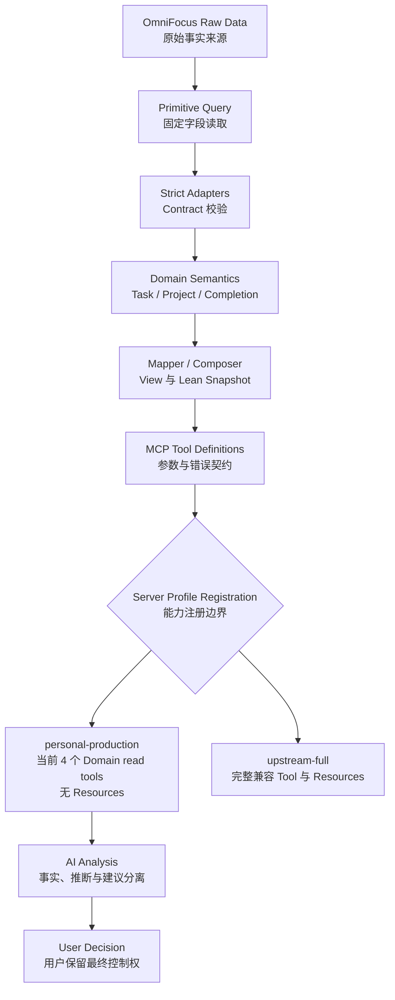

# OmniFocus-Agent-MCP Architecture Audit v1

## 1. 审查基线与范围

| 项目 | 基线 |
|---|---|
| Repository | `GlassyWorld/Omnifocus-Agent-MCP` |
| Code baseline | `a22b89489410aadd6aad61b69fbfcb60523f66f6`（`main`）加当前未提交 Profile refactor |
| Package version | upstream-compatible `1.9.2` |
| Architecture label | `v1.0-personalized` |

本报告以当前代码、单元测试和 Accepted ADR 为事实来源，覆盖：

- Repository 与 Server registration 架构。
- Task、Project、Completion、Snapshot Domain。
- `personal-production` 当前注册的四个 Domain read tools。
- Planned / Due direct-owner semantics。
- Lean Snapshot 与 Full Snapshot 的边界。
- AI 分析与 OmniFocus mutation 的边界。

重点核对路径：

- `src/config/serverProfile.ts`
- `src/serverRegistration.ts`
- `src/serverInstructions.ts`
- `src/tools/definitions/`
- `src/tools/primitives/`
- `src/domain/task/`
- `src/domain/project/`
- `src/domain/completion/`
- `src/domain/snapshot/`
- `src/**/*.test.ts`
- `engineer_log/`
- `docs/architecture/decisions/`

---

## 2. 当前整体架构

项目已经在 upstream OmniFocus MCP 的通用访问能力之上形成个人化 Domain Semantic Layer。当前代码路径是：

```text
OmniFocus Raw Data
    -> Primitive Query
    -> Strict Adapter
    -> Domain Semantics
    -> Mapper / Composer
    -> MCP Tool Definition
    -> Profile-specific Registration
    -> AI Analysis
```

主要职责：

- Primitive 通过 `queryOmnifocus` 请求固定 Raw field set。
- Adapter 校验字段、类型、日期和关联关系；Contract 不成立时显式失败。
- Domain classifier/resolver 表达 `kind`、native status、date provenance 和 ownership rule。
- Mapper 生成单对象 Domain View；Composer 生成跨对象 Snapshot read model。
- Tool handler 校验参数并返回稳定 JSON success/error envelope。
- Registration 根据 Server Profile 决定实际暴露的 Tool 和 Resources。

当前存在两个 Server Profile：

- `personal-production`：当前只注册 `get_task`、`get_project`、`get_completed_since`、`get_lean_snapshot`，不注册 Resources。
- `upstream-full`：注册仓库现有 16 个 Tool 和 6 类 Resources，包括 generic read 与 mutation 能力。

`OMNIFOCUS_MCP_PROFILE` 未设置或为空时默认进入 `personal-production`，`upstream-full` 只能显式启用。App Instructions 负责行为引导，但真正的 capability boundary 位于 Server registration。旧值 `personal-readonly` 已移除且无 alias。

---

## 3. 当前 Domain 状态

### 3.1 Task Domain

状态：已实现，并有 Adapter、classifier、mapper 和单元测试保护。

`TaskView` 表达：

- identity、name、note。
- `TaskKind`。
- native `taskStatus`。
- completion、drop、flag 的 direct/effective/source 语义。
- Due、Planned、Defer 的 direct/effective/source 语义。
- Project、Inbox、hierarchy、tags、repeat、estimate 和 timestamps。

`TaskKind` 的实际分类规则：

```text
isProjectRoot = true -> project_root
否则 hasChildren     -> action_group
否则                 -> action
```

Action 和 Action Group 当前是 Task Domain subtype，不是独立 Domain entity。

### 3.2 Project Domain

状态：已实现，并有严格 Adapter、日期/状态 classifier、mapper 和单元测试保护。

`ProjectView` 表达：

- canonical Project identity、name、note 和 kind。
- raw status 及 active/onHold/completed/dropped flags。
- Folder context。
- Due 与 Defer provenance。
- direct/all Task IDs、总数和按 native status 的 aggregate counts。
- timestamps。

Project 的 canonical ID 是 Project root Task ID。Project Domain 返回 Task aggregate 和 IDs，不返回每个 Task 的完整 `TaskView`；需要对象细节时应选择性调用 `get_task`。

### 3.3 Completion Domain

状态：基础事件模型已实现并测试。

```text
Direct completionDate
    -> Completion Adapter
    -> CompletedTaskView
    -> get_completed_since
```

冻结规则：

- 使用 direct `completionDate`，不从 current `taskStatus` 或 `modificationDate` 推导历史。
- `since` 与 `until` 是包含端点的绝对时间区间。
- `since` 必填；`until` 缺省时使用 handler 当前时间。
- 接受带 `Z` 或明确 UTC offset 的 ISO datetime，并规范化为 UTC。
- 排除 Project root completion event。
- 保留 Action 与 Action Group completion event。
- 空数组是成功结果，不是 `not_found`。

`CompletedTaskView` 是完成事件的事实投影，不是对象当前完整状态，也不提供历史版本序列。

### 3.4 Lean Snapshot Domain

状态：v1 factual semantics 已冻结并有完整单元测试。

```text
LeanSnapshotView
├── projects.active
├── projects.planned
├── projects.deadline
├── attention
└── inbox
```

每个 section 独立排序、计数和截断，并返回 `total`、`returned`、`truncated`、`items`。`limitPerSection` 默认 25，允许 1 至 100；各 section 从完整 candidate set 分类后独立截断，所以 section 可以重叠。

Lean Snapshot 是 all-system compact current-state read model，不是数据库导出，不包含 completion history、health、risk、priority、recommendation、Waiting inference 或完整 Task 展开。Project root 不作为 Task Attention 或 Inbox item 出现。

---

## 4. Planned、Due 与 Attention 规则

### 4.1 Direct ownership 的准确含义

代码已经实现 direct-owner signal rule，但没有 `Owner` 类型、`OwnerView`、Owner Adapter、Owner aggregate 或 Owner Tool。

ADR-002 中的 Owner 是从 provenance 推导出的语义角色：直接拥有某个 Planned/Due 值的现有 Task-shaped object 承担该信号。它不是新的核心 Domain entity。

### 4.2 Planned

```text
Action / Action Group direct Planned
    + direct date 已到达
    + native status 不是 Blocked
    -> Task Attention reason: planned

Active Project root direct Planned
    + direct date 已到达
    -> projects.planned

Inherited Planned
    -> 保留 effective fact 和 source=inherited
    -> 不生成独立 Planned signal
```

### 4.3 Due

```text
Action / Action Group direct Due
    + native status 为 DueSoon 或 Overdue
    -> Task Attention reason: dueSoon / overdue

Active Project root direct Due
    + native root status 为 DueSoon 或 Overdue
    -> projects.deadline

Inherited Due
    -> 保留 effective fact 和 source=inherited
    -> 不生成独立 deadline signal
```

不同 direct owner 即使日期相同仍是不同信号；系统按 ownership provenance 去除 inherited fan-out，不按 timestamp 去重。

Flagged 不使用上述 direct-only gate：当前 Attention classifier 使用 `effectiveFlagged`，并通过 direct/effective/source 保留 provenance。

---

## 5. MCP Tool 与 Profile 边界

### `get_task`

读取一个由精确 ID 或区分大小写的精确名称定位的 Task-shaped object，返回当前数据库中仍可定位对象的 `TaskView`。查询包含 completed/dropped 对象，但不提供对象历史版本或状态变更记录。调用方必须检查 `kind`。

### `get_project`

读取一个由 canonical Project root Task ID 或精确名称定位的 Project，返回 `ProjectView`。它提供 Project aggregate，不替代 Task detail query。

### `get_completed_since`

返回明确绝对时间闭区间内的 direct completion events，服务于周/月回顾等历史分析输入。

### `get_lean_snapshot`

提供当前全系统的紧凑事实入口，并通过 sections、Attention ownership 和 truncation contract 支持选择性下钻。它不是普通对象查询，也不是 Full Snapshot。

四个 Tool 的公开错误码为：

- `invalid_arguments`
- `not_found`（单对象 Tool）
- `ambiguous_match`（单对象 Tool）
- `query_failed`

Adapter、Domain Contract、Primitive 或 bridge execution failure 通常映射为 `query_failed`，不能解释为“没有数据”。当前 `ambiguous_match` 只返回通用错误，不返回候选对象列表。

Generic read、Resources 和 mutation tools 仍保留在 `upstream-full`，但不会在当前 `personal-production` 中被注册或发现。不能据此声称整个代码仓库已经移除写入实现。

---

## 6. 当前核心概念判断

| 概念 | 当前状态 | 代码中的实际定位 |
|---|---|---|
| Task | 已实现 | 主要 Domain entity 与精确对象 View |
| Project | 已实现 | 主要 Domain entity，与 root Task 使用 canonical identity |
| Completion | 已实现 | direct completion event projection |
| Lean Snapshot | 已实现 | 组合型 current-state read model |
| Action | 部分实现 | `TaskKind=action`，无独立 Domain |
| Action Group | 部分实现 | `TaskKind=action_group`，无独立 Domain |
| Project Root | 已实现为语义分类 | `TaskKind=project_root`，同时承担 Project canonical root 关系 |
| Owner | 仅实现语义规则 | direct Planned/Due signal role，不是 Domain entity |
| Folder | 部分实现 | Project context；无个人化独立 Domain |
| Tag | 部分实现 | Task facts 与 upstream capability；无个人化独立 Domain |
| Health/Risk/Priority | 未实现为事实 | 属于 AI inference，不在 Domain Contract 中 |
| Recommendation | 未实现为 Domain | 明确位于 AI analysis layer |
| Full Snapshot MCP | 暂缓 | 当前采用手动/plugin/file 导出后交由 AI 分析 |

因此，不能把当前系统概括为已经形成“Owner Domain”。更准确的描述是：Task 与 Project 是主要实体，Completion 与 Snapshot 是面向分析的 read model，direct ownership 是 Snapshot signal classification 的冻结规则。

---

## 7. `get_action` 的当前判断

当前不需要独立 `get_action`。

原因：

- `TaskView.kind` 已区分 Action、Action Group 和 Project root。
- `get_task` 已提供三类 Task-shaped object 所需的 identity、status、date provenance、hierarchy 和 context。
- 仅增加 Action filter 会复制 locator、error 和 output contract，并扩大 Tool surface，却不增加新的 Domain semantics。

只有当 Action 获得独立 lifecycle、invariant、health/execution state、identity model 或稳定分析价值，且这些语义无法由 `TaskView.kind` 清晰表达时，才应先复审 Action Domain，再决定是否增加 Tool。

---

## 8. Full Snapshot 当前边界

Full Snapshot MCP 当前暂缓开发，而不是既定的下一阶段实现目标。

原因是实际使用频率较低，当前采用：

```text
OmniFocus 手动 / plugin / file 导出
    -> 用户提供 artifact
    -> AI 进行低频深度分析
```

`dump_database` 是 upstream raw/full report capability，不是稳定的 Full Snapshot Domain read model。Lean Snapshot 也不应通过不断增加字段演变为 Full Snapshot。

只有未来出现明确、重复的个人需求，且手动导出造成可观察负担或无法满足时效/Contract 要求时，才重新评估独立 Full Snapshot read model。

---

## 9. 当前架构优势

- Domain-first pipeline 将 OmniFocus Raw structure 与 AI-facing Contract 分离。
- Strict Adapter 对 malformed Raw data 显式失败，不静默生成部分可信结果。
- `TaskKind` 统一表达 Task-shaped object，避免过早建立 Action Domain。
- direct/effective/source 同时保留事实与来源。
- direct-owner Planned/Due rule 消除 inherited Attention fan-out。
- Lean Snapshot 将全局 current-state 与详情、历史完成和 AI interpretation 分离。
- `personal-production` 在 Server registration 层形成可测试的精选 capability surface，当前注册集合只读。
- facts、Domain semantics、AI inference、recommendation 与用户决策保持分层。

---

## 10. 当前架构风险

- 已部署 LaunchAgent 若仍使用旧 `personal-readonly` 值会 fail fast，需要人工迁移。
- `upstream-full` 与 `personal-production` 共用同一 Tool registry，新增 Tool 时必须维护显式 profiles allowlist 和精确集合测试。
- Project/root join、Due consistency 和 Snapshot composer invariant 较严格；Raw contract drift 会使整次 Domain query 失败。
- Snapshot 每个 section 独立截断；调用方若忽略 `total`、`returned`、`truncated`，可能把部分 items 当作完整集合。
- Task、Project 和 Snapshot Adapter 存在相似字段校验，未来 Raw field 变化需要同步维护多个 contract。
- 完整 Guide、App Instructions、Server Instructions 与架构文档存在语义漂移风险，必须以代码和测试为最高事实来源。
- Generic、mutation 与个人化 Domain capability 同仓共存，维护者必须持续区分“仓库完整能力”和“个人化部署暴露能力”。

---

## 11. 当前边界与演进方向

当前已经实现：

- Task、Project、Completion、Lean Snapshot Domain。
- `personal-production` 当前注册的四个 Domain read tools。
- Planned/Due direct-owner semantics。
- Profile-specific Tool/Resource registration。
- Profile-specific Server Instructions。

当前不包含：

- 独立 Action Domain 或 `get_action`。
- Owner Domain/entity。
- Full Snapshot MCP。
- Domain-level health、risk、priority 或 recommendation。
- AI 自动决策或 `personal-production` 写入能力。

合理的近期方向是保持现有 Contract 稳定，根据真实使用反馈评估 Review workflow 和分析表达；不应仅为概念完整性增加 Tool、Domain 或 Snapshot 字段。

---

## 12. 最终架构图



---

## 13. 审查结论

当前仓库已经形成可测试的个人化 Domain Semantic Layer，并通过 `personal-production` Profile 将当前四个 Domain read tools 作为独立 Server capability surface 暴露。其核心不是抽象的 Owner entity，而是稳定的 Task/Project facts、Completion event、Lean Snapshot read model，以及基于 provenance 的 direct-owner signal rule。

当前最重要的架构边界是：

```text
OmniFocus facts
    -> Domain semantic projection
    -> read-only analysis surface
    -> AI inference / recommendation
    -> user decision
```

Full Snapshot MCP、Action Domain 和 Owner Domain 均不是当前已承诺能力。后续演进应由真实、重复的个人需求触发，并继续保持事实、语义、推断和操作之间的边界。
