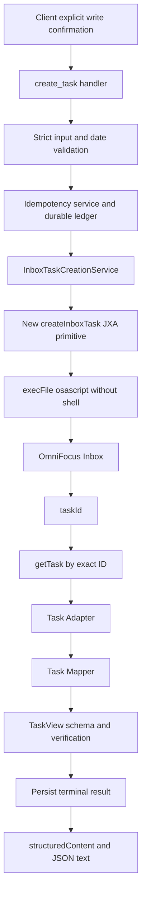

# ADR-006：受控 `create_task` V1 与 Inbox-only 演进边界

> ADR 状态：已接受；允许进入 Phase 0/Phase 1 绿色检查点实施<br>
> 目标 Profile：`personal-production`<br>
> 范围：受控创建一个 Inbox Task<br>
> 基线 commit：`f79ae21da7f90fa39e45022c360b1a487d0f76bd`（2026-07-13 审查）

> Phase 2 amendment（2026-07-14，已接受）：隔离 Project Canary 证明 OmniFocus
> 读侧以 Project root Task ID 同时作为 canonical Project ID 和 Project 顶层 action
> 的 `hierarchy.parentId`。因此 Phase 2B 顶层 Project placement 验证要求
> `actual.project.id === requestedProjectId` 且
> `actual.hierarchy.parentId === requestedProjectId`。这不授权 Phase 4 的普通
> parent Task placement。

## 1. 决策摘要

`create_task` V1 是一个单阶段、Inbox-only、显式授权、带持久化幂等保护和写后精确读取的 mutation Tool。

最终边界如下：

| 设计项 | 决定 |
|---|---|
| Tool 名称 | `create_task` |
| Profile | 只加入 `personal-production` |
| `upstream-full` | 保留原 `add_omnifocus_task`，不加入 `create_task` |
| 目标位置 | 固定 Inbox |
| 输入字段 | `name`、`note`、`plannedDate`、`dueDate`、`deferDate`、`flagged`、`estimatedMinutes`、`idempotencyKey` |
| 明确排除 | project、parent task、tags、repeat、notifications、batch、其他 CRUD |
| 调用协议 | 单阶段 `create_task(payload)` |
| 幂等 | V1 首版必须实现；优先使用跨 retry 稳定的 MCP/client request ID；24 小时 replay window + 永久 tombstone |
| 日期 | 仅接受带 offset 或 `Z` 的绝对 ISO 8601 datetime；拒绝纯日期和无 offset datetime |
| Primitive | 新建严格的 Inbox-only JXA primitive；不包装现有 `addOmniFocusTask`，不经 shell 执行 |
| 成功输出 | 内部使用完整 `TaskView` 验证，外部返回 compact `CreatedTaskView` |
| 验证 | 创建返回 task ID 后，按 ID 走现有 Task Adapter、Mapper、Schema 精确回读 |
| 写入结果不确定 | 返回 `verification_failed` 或 `partial_success`，`mayHaveWritten: true`，禁止自动重试 |
| Tag | 不进入 V1；未来 T1 结构化发现、T2 仅使用实时验证过的 Active Tag ID |
| 自动创建 Tag | `personal-production` 永久禁止 |
| Inbox 边界 | Phase 1 全程 Inbox-only；只有 Phase 1 Production Acceptance 后，最早在 Phase 2 放开 |
| Phase 2 首次能力 | 仅按实时验证的 canonical Project ID 创建到 Active Project；保持单阶段 |
| Parent placement | 保留 Phase 4，并优先升级为 prepare/commit |

## 2. 当前仓库事实

### 2.1 基线与 Profile

审查时工作树为空，最近提交为：

```text
f79ae21 docs: consolidate personalization guidance
4850367 refactor: rename personal profile for production
a22b894 docs: reorganize project records and navigation
c7bda4e docs: document instructions and structured output contracts
204a64c feat: add structured output contracts for domain tools
```

`personal-readonly -> personal-production` 重构已经完成。当前 `personal-production` 精确注册：

```text
get_task
get_project
get_completed_since
get_lean_snapshot
```

当前没有 `create_task`，没有 Resources，Server Instructions 明确声明当前实例只读。Profile 重构不再是阻塞项；实现时必须同步更新精确注册测试和 Instructions。

### 2.2 可复用的 Domain 路径

现有 Task Domain 已提供：

```text
getTask({ id })
  -> queryOmnifocus 固定字段查询
  -> adaptQueryTaskItem
  -> RawTask
  -> mapRawTaskToTaskView
  -> TaskView
  -> taskViewSchema
```

这条路径已经处理 Task kind、direct/effective date、flag provenance、Inbox/Project context、hierarchy、tag、repeat、estimate 和 timestamps。`create_task` 不应另造一套读取语义。

### 2.3 现有创建能力不能直接作为 V1

`upstream-full` 的 `add_omnifocus_task` 与其 primitive 存在以下不兼容点：

- 输入 Schema 宽松，日期接受任意字符串，名称和估时没有边界，Schema 非 strict；
- 支持按名称选择 Project、按名称或 ID 选择 parent，存在放置歧义；
- parent 未找到时可能回落到 Project 或 Inbox，属于 fail-open placement；
- Tag 使用名称，找不到时尝试创建，添加失败还可能被吞掉；
- handler 记录完整 args，可能把 task name 和 note 写入日志；
- 返回文本成功消息，没有稳定 `outputSchema` 或 `structuredContent`；
- 使用 `any` 和宽泛的 primitive result；
- primitive 混合脚本生成、临时文件执行、结果解析和多种放置策略。

可借鉴的仅是：Inbox 创建语句、task ID 返回思路、临时脚本文件执行方式、字符串 escaping 测试经验。日期构造必须在严格绝对时间契约下重新封装，不能原样继承纯日期和宿主时区的隐含行为。

### 2.4 当前 integration safety 的缺口

现有 integration test 依靠 `TEST:` 名称前缀、运行期 registry 和 afterAll cleanup；它没有在每次 mutation 前验证当前 OmniFocus 数据库名称。因此它不足以作为 `create_task` 真实写入验收的安全边界。

## 3. 目标与非目标

### 3.1 目标

- 只在用户明确要求写入 OmniFocus 时创建一个 Task；
- 固定写入 Inbox，不做目标解析；
- 对输入、日期、输出和错误建立稳定契约；
- 防止客户端 retry、模型重复调用和并发调用造成重复任务；
- 创建后按 task ID 精确回读，区分“未写入”与“可能已写入”；
- 默认日志不包含 task name、note 或原始自然语言；
- 保持 `upstream-full` compatibility surface 不变；
- 为未来 existing-Tag-by-ID 接入预留幂等指纹、primitive 和 readback 扩展点。

### 3.2 非目标

V1 不支持以下字段或行为：

```text
project / projectId / projectName
parent task / parentTaskId / parentTaskName
tags / tagNames / tagIds
repeat rule
notifications
batch create
create project or tag
edit / move / complete / delete
generic executor
```

这些字段因为 input Schema `.strict()` 而被拒绝，不能静默忽略。

## 4. 外部参考与取舍

本次对比基于以下仓库快照：

| 参考 | 审查 commit | 采用 | 拒绝 |
|---|---|---|---|
| [s-morgan-jeffries/omnifocus-mcp](https://github.com/s-morgan-jeffries/omnifocus-mcp) | `aa8bd61` | Project/parent 互斥、mutation safety guard、Unicode roundtrip、返回 task ID、Agent routing eval | V1 的 batch、Project、parent、Tag name 写入和宽能力面 |
| [deverman/FocusRelayMCP](https://github.com/deverman/FocusRelayMCP) | `74190b5` | read before write、name for discovery/ID for mutation、ambiguous refusal、verify、compact mutation workflow、生命周期 Tool 分离 | 把 preview 强制放入本地单任务 V1；FocusRelay 本身未提供 create V1 |
| [jqlts1/omnifocus-mcp-enhanced](https://github.com/jqlts1/omnifocus-mcp-enhanced) | `3f01e8b` | planned date、引号/反斜杠/apostrophe/Unicode escaping 测试、Project/parent 冲突拒绝 | 按名称匹配、Tag 自动创建、把多种放置混入 V1 |
| [mattsmallman/omnifocus-mcp](https://github.com/mattsmallman/omnifocus-mcp) | `0e8bf68` | 明确的单任务 Tool description 和自然语言路由案例 | TOON、Persistent PTY Bridge、batch add、Agent Skill 打包 |
| [vitalyrodnenko/OmnifocusMCP](https://github.com/vitalyrodnenko/OmnifocusMCP) | `026237d` | `list_tags`/`search_tags` 分离、显式状态、层级和数量控制 | Tag 名称写入、缺失 Tag 静默跳过、Tag CRUD 进入个人 Profile |

### 4.1 Tag 专项结论

| 实现 | 查询返回 ID | 层级/状态 | 任务写入 | 缺失 Tag | 写后验证 | 本项目结论 |
|---|---:|---|---|---|---:|---|
| 当前仓库 | 是 | 一层 parent、`active` boolean | 名称 | 自动创建或吞错 | 否 | 只考虑复用底层枚举，不复用公开文本或写入行为 |
| s-morgan-jeffries | 是 | parent、三态、互斥子标签 | 名称 | 失败 | 不作为本项目依据 | 吸收模型和测试，拒绝名称写入 |
| FocusRelay | 是 | ID、名称，读取侧有结构化列表 | ID | 拒绝 | 可 verify | 作为 T1/T2 安全主参考 |
| vitalyrodnenko | 是 | 状态、parent、search | 名称 | 静默跳过 | 否 | 吸收发现 Tool，拒绝写入语义 |
| enhanced | 底层可查 | 有限 | 名称 | 自动创建/可能吞错 | 否 | 只吸收 escaping 测试 |

## 5. Tool 契约

### 5.1 名称与 description

选择 `create_task`。

- `create_inbox_task` 把 V1 的放置限制固化进长期 Tool 名称，未来按 ID 增加 Project placement 时需要改名或并存；
- `capture_task` 容易被理解为快速记录、草稿或弱确认操作；
- `create_task` 与 `get_task` 命名一致，模型路由最直观；
- 它只注册到 `personal-production`，而 `add_omnifocus_task` 只存在于 `upstream-full`，同一 Profile 不会出现两个相似创建 Tool。

建议 description：

```text
Create exactly one new OmniFocus task in the Inbox. Use only after the user
explicitly asks to create or add a task in OmniFocus. V1 does not support
projects, parent tasks, tags, repeats, notifications, batches, or updates.
Requires a fresh idempotency key for each user-authorized creation intent.
Do not call for planning, recommendations, or statements of future work.
```

### 5.2 用户意图授权

应调用：

```text
“帮我创建一个任务……”
“把这件事加入 OmniFocus……”
“在 Inbox 记录……”
“新增任务……”
```

不应调用：

```text
“我明天需要提交报告”
“这件事应该记下来吗？”
“帮我规划一下”
“给我一个任务拆解”
```

“提醒我以后处理这个问题”没有指定提醒载体，也没有明确指向 OmniFocus；必须先澄清，不调用 `create_task`。

授权由三层共同构成：

1. Server profile registration 决定客户端是否拥有创建能力；
2. Server Instructions 规定只有明确写入请求才能路由；
3. ChatGPT 客户端写入确认 UI 在实际 Tool call 前向用户展示并确认。

V1 不增加 `confirmed: true`、`intentToken` 或自由布尔字段。模型可以自行填写普通字段，因此它们不构成可信授权。若未来需要支持不受信客户端、委托写入或高风险目标，应升级为服务端签发、短期有效、绑定 payload hash 的 prepare/commit token。

### 5.3 单阶段与升级条件

V1 采用：

```text
create_task(payload)
```

理由：本地单用户、单 Task、固定 Inbox、没有目标解析；客户端已经提供写入确认 UI。两阶段会增加 plan storage、过期、状态恢复和额外 Tool 路由，却没有在 V1 中解决更多目标歧义。

Phase 2 只有同时满足下列条件时，Project placement 才可继续单阶段 `create_task(payload)`：目标是来自真实只读查询结果的单个 canonical Project ID；服务端写入前实时重新验证；只允许 Active Project；客户端确认 UI 能展示明确目标；不做名称解析；不是批量或多目标；失败绝不回落 Inbox。

出现以下任一条件时必须升级为 `prepare_task_creation -> commit_task_creation`：按名称解析 Project、同名或目标歧义、parent placement、批量、多目标、复杂 recurrence、notification、On Hold Tag、客户端不能可靠展示目标、需要确认多个转换结果，或风险显著提升。

因此 Project placement 本身不自动要求两阶段；严格的单 Active Project ID 是 Phase 2 唯一可保持单阶段的扩展。Parent placement 固定留在 Phase 4，不能与 Phase 2 合并。

## 6. 输入 Schema

设计草案：

```ts
const wellFormedUnicode = (value: string) => !hasLoneSurrogate(value);

const absoluteDateTimeSchema = z
  .string()
  .datetime({ offset: true })
  .refine(value => /(?:Z|[+-]\d{2}:\d{2})$/.test(value), {
    message: "datetime must include Z or an explicit UTC offset",
  });

export const createTaskInputSchema = z.object({
  name: z.string()
    .trim()
    .min(1)
    .max(500)
    .refine(wellFormedUnicode),

  note: z.string()
    .max(20_000)
    .refine(wellFormedUnicode)
    .optional(),

  plannedDate: absoluteDateTimeSchema.optional(),
  dueDate: absoluteDateTimeSchema.optional(),
  deferDate: absoluteDateTimeSchema.optional(),

  flagged: z.boolean().optional(),
  estimatedMinutes: z.number().int().positive().max(10_080).optional(),

  idempotencyKey: z.string().uuid().optional(),
}).strict().superRefine(validateDateRelationships);
```

契约说明：

- `name` trim 后存储，纯空格失败；`note` 不 trim，保留换行、tab 和有意义的前后空白；
- `note: ""` 合法，表示显式空 note；`null` 对所有字段均非法，只有 omitted 表示未提供；
- `flagged` omitted 表示不设置、由 OmniFocus 使用原生默认；`false` 表示显式写入 false；
- 不进行 NFC/NFKC 规范化，避免改变用户文本；保留合法 Unicode，拒绝孤立 surrogate；
- `estimatedMinutes` 最大 10,080 分钟（一周），防止错误单位或异常数值；
- 日期只能是绝对 datetime。`2026-07-14` 和 `2026-07-14T15:00:00` 均拒绝；
- `.strict()` 保证 `project`、`parentTaskId`、`tags` 等未来或 upstream 字段不会被忽略；
- 实现时导出的 MCP `schema` 必须保留上述约束，不能只导出丢失 `superRefine` 的宽松形状；若 SDK registration 只接受 raw shape，handler 必须再次执行完整 object parse。
- `idempotencyKey` 仅在已验证的稳定 MCP request ID 可用时允许省略；handler 必须在任何 Ledger reservation 前解析 effective key，metadata 和参数均不存在则 `invalid_arguments`。
- 当前生产 Web/Tunnel 路径尚未证明 MCP request ID 可跨透明 retry 稳定复用，因此实际公开 Tool Schema 将 `idempotencyKey` 设为 required；模型为每个新创建意图生成 UUID，并在同一次 Tool 调用的透明 retry 中复用。只有单独完成稳定性实验后，才能把公开字段改回 optional 并启用 metadata 来源。

### 6.1 Semantic Canonicalization

Schema parse 后、计算 fingerprint 和进入 verifier 前，必须把输入转换为最终状态语义，而不是保留“字段是否出现”的语法差异：

```ts
interface CanonicalCreateTaskPayload {
  name: string;
  note: string;
  plannedDate: string | null;
  dueDate: string | null;
  deferDate: string | null;
  flagged: boolean;
  estimatedMinutes: number | null;
}
```

V1 fingerprint 的 domain-separation namespace 固定为 `create_task:v1`，hash 输入为 namespace + canonical JSON。Phase 1 绝不加入 `destination`、`projectId`、`projectName`、parent、Tag、placement mode 或 token 字段。Phase 2 扩展目的地时必须版本化为 `CanonicalCreateTaskPayloadV2`，使用 `create_task:v2` namespace，并新增 `{ kind: "inbox" } | { kind: "project"; projectId: string }`；相同任务内容在 v1/v2 不会碰撞。

规范化规则：

```text
name             -> trim 后值
note omitted     -> ""
note = ""        -> ""
flagged omitted  -> false
flagged = false  -> false
date             -> new Date(value).toISOString()，即 UTC instant
date omitted     -> null
estimate omitted -> null
```

- fingerprint、primitive request 和 verifier 都使用 canonical payload；
- 同一 key 下 `note` omitted/空字符串、`flagged` omitted/false 等语义等价输入不冲突；
- 原始字段存在性只可在当前请求内用于产生提示，不写入 Ledger；
- warning 本身不进入 fingerprint，产生 warning 的 canonical date instant 会进入；
- 不做 Unicode NFC/NFKC，也不把 CRLF 静默改成 LF。若 OmniFocus 实测会统一换行，必须在 Phase 0 探针后把唯一转换规则写入 canonicalizer，并补 roundtrip test。

## 7. 日期语义

### 7.1 三种日期

- `deferDate`：在此时刻前不可用/延后显示；
- `dueDate`：必须完成的截止时刻；
- `plannedDate`：计划处理时刻，只是 scheduling signal，不决定 availability 或 overdue。

### 7.2 时区与自然语言

AI 负责根据用户当前时区把“明天下午三点”解析为带 offset 的绝对时间。例如上海时区：

```text
2026-07-14T15:00:00+08:00
```

如果用户时区未知，或 DST 边界使本地时间不存在/重复，必须澄清。服务器不猜测时区，不接受纯日期，也不使用执行机器的午夜替代用户意图。

输入用于幂等指纹前统一规范化为 UTC ISO instant。

### 7.3 唯一日期写入算法

V1 固定使用数值时间路径，不允许实现阶段自行选择本地化字符串或宿主时区 components：

```text
ISO 8601 datetime with offset/Z
  -> Node Date.parse
  -> epochMilliseconds（整数）
  -> 作为 JSON number 传给 JXA primitive
  -> new Date(epochMilliseconds)
  -> 赋给 OmniFocus dueDate/deferDate/plannedDate
```

- 单位唯一为 milliseconds since Unix epoch；不使用 epoch seconds；
- JXA 参数通过 JSON 文件或受控 argv 传递，不插入可执行源码；
- 禁止 `date "July 14..."`、`date "2026-07-14 15:00"`、截取年月日和依赖系统语言的 parse；
- verifier 把 direct date 解析为 epoch milliseconds 比较，允许 OmniFocus 秒级存储造成的误差 `<= 1000 ms`；
- `Z` 与不同 offset 表达同一 instant 时，canonical payload、fingerprint 和写入值完全等价；
- 测试覆盖 spring-forward、fall-back、系统语言切换、Mac 时区与输入 offset 不同、跨日、`+14:00` 与 `-12:00`。

若 Phase 0 探针证明当前 OmniFocus/JXA API 不能可靠接受 `Date(epochMilliseconds)`，必须停在 Phase 0 重新评审；不得自行回退到本地化 AppleScript date string。

### 7.4 关系校验

- 同时提供 `deferDate` 与 `dueDate` 且 `due < defer`：`invalid_arguments`；
- `plannedDate < deferDate` 或 `plannedDate > dueDate`：允许，因为 planned 是独立 scheduling signal，但成功结果包含 warning；
- 写后日期按 epoch instant 比较，误差上限为 1000 ms，不接受日期或时区导致的日历日漂移；
- DST 测试必须覆盖不存在的本地时间、重复时间和 offset 变化。

## 8. 幂等与重复保护

### 8.1 Key 来源与生产前置实验

V1 首版必须支持幂等，不把它推迟到 Profile 上线之后。key 来源优先级为：

1. MCP request metadata 中跨透明 retry 稳定的 request ID（若协议与当前 SDK 实测可获得）；
2. 客户端生成、并在透明 retry 中复用的 `idempotencyKey`；
3. 模型生成 UUID，仅作为最后方案。

上线前必须完成 `Client Retry Key Stability Test`，记录响应超时、MCP 短暂中断、服务端写完但客户端未收到响应、客户端手动 retry、模型再次 Tool call 时，第二次调用是否保留完全相同 key。未验证前，不能把客户端会复用 key 当作事实。effective key 选择 `stable metadata request ID ?? args.idempotencyKey`，加 namespace 后只以 hash 写入 Ledger；metadata 不满足稳定性实验时不得启用第一优先级。

若当前 ChatGPT App/MCP client 无法稳定复用 request ID/key，Phase 1 不得注册，协议必须升级为服务端签发 plan ID 的 prepare/commit。服务端在收到第一次调用后才生成 key，无法识别已经使用新 key 到达的重复提交，因此不能解决客户端重复识别。

不做 task name dedupe。不同任务可以合法同名；名称、日期或 note 相同都不能证明是同一用户意图。

### 8.2 持久化状态机与锁

服务端维护一个本地、原子写入、进程间加锁的 idempotency ledger：

```text
reserved -> write_started -> task_created(taskId) -> verified
reserved/write_started -> terminal_prewrite_error（仅有结构化证据证明尚未创建）
write_started -> outcome_unknown
task_created -> verification_failed -> verified
```

状态规则：

| 状态 | 可能已写入 | 可再次执行 | taskId | 清理 |
|---|---:|---:|---:|---|
| `reserved` | 否 | 否 | 否 | 不能按普通 TTL 删除 |
| `write_started` | 可能 | 否 | 否 | 恢复为 `outcome_unknown` |
| `task_created` | 是 | 否 | 必须 | 可继续 readback，不可再次 create |
| `verified` | 是 | 否 | 必须 | replay 后保留 tombstone |
| `terminal_prewrite_error` | 否 | 否（同 key） | 否 | 保留 tombstone |
| `verification_failed` | 是 | 否 | 必须 | 保留 tombstone，可人工重试 readback |
| `outcome_unknown` | 可能 | 否 | 可选 | 保留 tombstone，要求人工检查 |

`write_started` 必须在调用 JXA executor 前持久化。进程可能在脚本实际创建前崩溃，此时恢复后仍 fail closed；接受“实际未写入但被标为 outcome unknown”以换取不重复创建。取得 task ID 后必须立即持久化 `task_created`，不能等 readback。

个人单用户 V1 选择单实例全局 mutation lock，降低每-key lock、索引竞争和 stale lock 的复杂度。锁文件与 Ledger 位于服务私有 state directory，权限 `0700/0600`；锁获取有短超时，使用 OS 原子 exclusive create + owner PID/start timestamp，stale lock 只能在确认 owner 不存在后回收。不同 key 也串行，吞吐量降低可接受。Ledger 更新采用同目录临时文件、flush/fsync、atomic rename；启动时校验版本与 checksum，损坏时禁用写入并返回 `write_disabled`，绝不新建空 Ledger 后继续。多实例必须共享同一 state directory 和 lock；无法共享则禁止第二实例启用 mutation。

### 8.3 Ledger privacy

持久化记录仅允许：

```ts
interface IdempotencyLedgerRecord {
  keyHash: string;
  payloadHash: string;
  state:
    | "reserved" | "write_started" | "task_created" | "verified"
    | "terminal_prewrite_error" | "verification_failed" | "outcome_unknown";
  taskId?: string;
  resultCode?: string;
  createdAt: string;
  updatedAt: string;
  replayUntil?: string;
  tombstoneUntil?: string;
}
```

不得持久化完整 name、note、TaskView、Tool args、成功 envelope、错误消息、自然语言或脚本。错误只存稳定 `resultCode`。

### 8.4 Replay window 与 tombstone

- Replay window：从首次 `verified` 起 24 小时；
- Tombstone retention：服务 state directory 生命周期内永久保留，不按时间删除；进行中、`outcome_unknown` 和 `verification_failed` 同样不可淘汰；
- 24 小时内同 key/同 payload：按 task ID 当前精确读取并重新构造 success，`replayed=true`；不保存或重放首次 envelope；
- 24 小时后：不再提供正常 success replay，返回 `duplicate_request`（detail=`replay_window_expired`），但 tombstone 继续阻止写入；
- 容量控制使用 compact record、分段文件和归档压缩，不以删除 key hash 换容量。仅可清理 24 小时后的可重放缓存（本设计本来不保存 envelope），不能删除 tombstone；
- tombstone 只有在用户明确执行破坏性 state reset/卸载时才可能丢失；该操作必须关闭 mutation 并警告旧 key 防护失效；
- 因相同 key 不会因普通 TTL 到期重新执行，且重启持久化、并发单写、outcome-unknown fail closed 全部成立，最终选择 `idempotentHint: true`。任一条件未实现或被配置禁用时，Tool 不得注册；不能只把 hint 改 false 后上线一个缺少重复保护的 V1。

重放返回当前状态，不保证逐字等于首次响应：

| 当前 readback | 结果 |
|---|---|
| 与 canonical payload一致 | 当前 compact success，`replayed=true` |
| Task 存在但已被编辑 | success + `replayed_current_state_changed` warning，返回当前状态，不重新创建 |
| Task 已删除或 not_found | `replay_target_unavailable`，`mayHaveWritten=true`，不重新创建 |
| 查询/Schema 失败 | `replay_target_unavailable`，已知 taskId，禁止 create |

同一 key 的行为：

| 场景 | 行为 |
|---|---|
| 同 key、同 payload、已 verified 且在 replay window | 按 taskId读取当前状态并重建结果，不再次写入 |
| 同 key、同 payload、确定 pre-write 失败 | 返回原错误；用户修正后必须换新 key |
| 同 key、不同 payload | `idempotency_conflict`，不写入 |
| 同 key、并发请求 | 一个持锁执行；其余等待短窗口后重放结果，或返回 `duplicate_request` |
| 同 key、状态 `write_started/outcome_unknown` | 返回 `duplicate_request` 或 `verification_failed`，`mayHaveWritten: true`，禁止自动重试 |
| replay window 已过、tombstone 仍在 | `duplicate_request`，不写入 |

### 8.5 响应丢失与崩溃窗口

primitive 写入成功、handler 返回前响应丢失时，只要 `verified` 已持久化，重放按 task ID 获取当前结果。

OmniFocus 已创建任务但进程在持久化 task ID 前崩溃，无法在不污染 Task note 的情况下做到严格 exactly-once。此时保留 `outcome_unknown`/陈旧 `write_started`，拒绝再次写入，并要求用户检查 Inbox。不得退化为同名搜索后自动决定重试。

## 9. 分层架构



建议模块职责：

```text
src/domain/taskCreation/createTaskSchemas.ts
  输入、成功 envelope、warning、verification diff

src/domain/taskCreation/createTaskIdempotency.ts
  canonical payload、fingerprint、ledger state machine、locking、TTL

src/domain/taskCreation/createTaskVerifier.ts
  request 与 TaskView 的确定性比较

src/tools/definitions/createTask.ts
  transport validation、错误映射、structured/text 一致性

src/tools/primitives/createInboxTask.ts
  仅 Inbox 写入；严格 typed result；无 routing policy

src/utils/epochDate.ts
  absolute instant -> epoch milliseconds

src/utils/safeOsaExecutor.ts
  execFile/spawn、timeout、buffer limit、0600 temp file、strict JSON

src/utils/mutationTestSafety.ts
  integration-mode database guard
```

### 9.1 Primitive 选择

选择 C：新建 Inbox-only primitive。

- 不选择 A（包装旧 primitive）：旧 primitive 的 fail-open、Tag 自动创建、name lookup 和日志行为难以通过 wrapper 证明不可达；
- 暂不选择 B（立即拆 shared create service）：V1 与 upstream 创建语义差异过大，过早共享会把不安全兼容行为带入新边界；
- 选择 C 可以把脚本收敛到“一个 Inbox Task + 一组受限属性”，测试和审计面最小。

Phase 1 不建立万能 placement engine，也不在内部 canonical payload 预埋 destination。未来 Phase 2 可以复用 Ledger、safe executor、epoch date、privacy-safe error 和 Task readback 基础，但必须另增 `resolveProjectById`、`validateProjectDestination` 与 `createTaskInProject`，再评估是否抽取共享 task-property builder。

不复用旧 primitive 的 `exec` 或字符串插值路径。新 primitive 使用 JXA，并通过 JSON data 把 canonical payload/epoch milliseconds 传入；用户内容不得成为可执行源码。绝不能修改旧 `addOmniFocusTask` 的行为来“顺便迁移” upstream。

primitive result 必须区分写入阶段：

```ts
type CreateInboxTaskResult =
  | { success: true; taskId: string }
  | {
      success: false;
      phase: "prewrite" | "postcreate" | "unknown";
      taskId?: string;
      errorCategory: string;
    };
```

### 9.2 无 Shell Executor 硬约束

只允许：

```ts
execFile("osascript", ["-l", "JavaScript", tempFile, payloadFile], options)
```

或等价 `spawn`。禁止 `exec(\`osascript ...\`)`。Executor 必须：

- 随机临时文件名，脚本和 payload 权限 `0600`，父目录仅当前用户可访问；
- `finally` 删除脚本和 payload；删除失败只记录路径 hash/错误类别，不输出内容；
- 明确 timeout，stdout/stderr 各自大小上限，超限立即终止子进程；
- 严格要求 stdout 是单个 JSON document；exit 0 + 空 stdout、混入非 JSON、未知字段均失败；
- 映射 exit code、signal、timeout、abort、parse failure；清理可能残留的子进程；
- stderr 和异常在日志/响应前清洗，不输出用户内容或脚本正文。

调用前 Ledger 已是 `write_started`，因此 timeout、abort、无 stdout、混合 stdout 或进程去向不明统一视为 `outcome_unknown`，`mayHaveWritten=true`。只有 JXA 在创建前返回结构化 `prewrite` 失败，才能映射 `write_failed`。

### 9.3 Post-create window 与属性顺序

Phase 0 必须用隔离测试环境做只读 API/合成脚本探针，产出 constructor capability matrix，确认 name、note、flagged、estimatedMinutes、dueDate、deferDate、plannedDate 中哪些能在创建调用中原子提供。正式流程固定为：

```text
1. Node 完成 Schema parse、canonicalization、关系校验和 epoch 转换
2. Ledger: reserved -> write_started（fsync 完成）
3. JXA create 调用：一次性带入探针证明可在构造时设置的全部属性
4. JXA 立即返回 taskId；即使后续字段失败，错误 JSON 也必须携带 taskId
5. Server 立即持久化 task_created(taskId)（fsync），不等待 readback
6. 若 capability matrix 证明存在不能构造时设置的字段，第二次 JXA 调用按 taskId 设置，固定顺序：note -> flagged -> estimatedMinutes -> deferDate -> dueDate -> plannedDate
7. 任一后设失败：停止后续设置，按 taskId 精确 readback，返回 partial_success 和实际状态
8. 全部完成后 exact readback 与 canonical verifier
```

构造时已设置的字段不在第二次调用重复设置。若所有字段都能原子构造，第 6 步为空。若 Phase 0 无法证明错误路径总能返回 taskId，则相关 timeout/crash 只能进入 `outcome_unknown`，不能宣称未写入。

## 10. 写后验证与成功输出

### 10.1 流程

```text
createInboxTask
  -> taskId
  -> getTask({ id: taskId })
  -> adaptQueryTaskItem
  -> RawTask
  -> mapRawTaskToTaskView
  -> taskViewSchema
  -> verify canonical state and placement
  -> project compact CreatedTaskView
```

验证至少包括：

- ID 与返回 task ID 相同；
- `location.inInbox === true`；
- `project === null`、`hierarchy.parentId === null`；
- `kind === "action"`；
- name 与 canonical trim 值一致；note 精确比较 canonical string；
- due/planned/defer 只比较 direct instant，误差 `<= 1000 ms`，不比较 effective date；
- flagged 与 canonical boolean 一致，不比较字段是否显式出现；
- estimate 与 canonical minutes/null 一致。Phase 0 必须先实测 OmniFocus 未设置时返回 null、0 还是 missing，并由 Adapter 统一为 null；
- V1 primitive/source guard 证明没有 Tag 写入路径。readback 不要求 `tags=[]`，避免把创建与回读间用户/自动化并发添加 Tag 误报为 partial success。

换行不默认归一化，note 先做精确比较。若隔离 roundtrip 证明 OmniFocus 稳定把 CRLF 转 LF，则把该转换加入 canonicalizer，而不是在 verifier 临时放宽。Unicode 不进行 NFC/NFKC；若 OmniFocus 自身规范化，必须记录实测规则并采用最小、确定性比较。

### 10.2 成功 Schema

内部仍用完整 `TaskView` 做 Domain verification，外部返回独立 compact projection，避免 repeat、hierarchy、timestamps、effective facts 和重复 placement 消耗 token：

```ts
const createdTaskViewSchema = z.object({
  id: z.string().min(1),
  name: z.string(),
  note: z.string(),
  location: z.object({ kind: z.literal("inbox") }).strict(),
  plannedDate: absoluteDateTimeSchema.nullable(),
  dueDate: absoluteDateTimeSchema.nullable(),
  deferDate: absoluteDateTimeSchema.nullable(),
  flagged: z.boolean(),
  estimatedMinutes: z.number().int().nullable(),
}).strict();

const createTaskSuccessSchema = z.object({
  success: z.literal(true),
  created: createdTaskViewSchema,
  idempotency: z.object({
    key: z.string().min(1).max(200),
    replayed: z.boolean(),
    replayUntil: absoluteDateTimeSchema,
  }).strict(),
  warnings: z.array(z.object({
    code: z.enum([
      "planned_before_defer",
      "planned_after_due",
      "replayed_current_state_changed",
    ]),
    message: z.string(),
  }).strict()),
}).strict();
```

完整 note 继续返回，因为它是用户刚提交并用于确认的值，输入已限制为 20,000 字符；若后续发现客户端 token 压力，必须另行版本化为 note metadata，不能无声截断。Ledger 永不保存 note。成功结果返回 effective key（参数 key 或客户端本就发送的稳定 request ID）；日志只记录 key hash。只暴露 `replayUntil`，不暴露内部 tombstone policy，避免暗示 replay window 到期后可以重用 key。

成功时 `structuredContent` 与 `content[0].text` 解析后的 JSON 必须完全相同。

### 10.3 错误输出

为兼容当前仓库四个 Domain Tool 的做法，V1 错误使用 JSON text + `isError: true`，不返回 `structuredContent`。成功 `outputSchema` 只描述成功 envelope。若未来 registry/SDK 明确支持 discriminated union error output，再单独统一所有 Domain Tool；不要让 `create_task` 独自采用无法被当前 registration 层可靠表达的伪 union。

错误 JSON：

```ts
type CreateTaskError = {
  success: false;
  error: {
    code: CreateTaskErrorCode;
    message: string;
    mayHaveWritten: boolean;
    retrySafe: boolean;
    taskId?: string;
    idempotencyKey?: string;
    verificationDiff?: Record<string, unknown>;
  };
};
```

## 11. 错误、重试与部分成功

| code | 触发条件 | 可能已写入 | 自动重试 | taskId | `isError` |
|---|---|---:|---:|---:|---:|
| `invalid_arguments` | Schema、日期关系或 unsupported field 失败 | 否 | 修正参数后用新 key | 否 | 是 |
| `write_disabled` | mutation feature flag关闭、Ledger 损坏或多实例安全条件不满足 | 否 | 否 | 否 | 是 |
| `safety_guard_failed` | production/test 共用的本地安全前置条件失败 | 否 | 否 | 否 | 是 |
| `test_environment_mismatch` | integration 数据库 identity/sentinel/name 任一不匹配 | 否 | 否 | 否 | 是 |
| `duplicate_request` | 相同 key 正在执行或结果不确定 | 可能 | 否 | 已知则返回 | 是 |
| `idempotency_conflict` | 同 key 不同 canonical payload | 否 | 否 | 原记录有则可返回 | 是 |
| `write_failed` | primitive 明确在创建前失败 | 否 | 仅用户重新授权并换新 key | 否 | 是 |
| `verification_failed` | 已写入或可能写入，但精确 readback 失败/schema drift/taskId 缺失 | 是或未知 | 否 | 已知则返回 | 是 |
| `partial_success` | Task 已创建，但属性或 readback 与请求不一致 | 是 | 否 | 是 | 是 |
| `replay_target_unavailable` | 已使用 key 的 task 已删除或当前无法读取 | 是 | 否 | 已知则返回 | 是 |
| `internal_error` | 写前未分类内部错误 | 由阶段决定 | 仅 `mayHaveWritten=false` 才可人工重试 | 已知则返回 | 是 |

关键映射：

- primitive 创建失败且明确 `prewrite`：`write_failed`, `mayHaveWritten=false`；
- primitive 无 task ID 或 phase unknown：`verification_failed`, `mayHaveWritten=true`；
- task ID 存在但 readback not_found/query failure/schema drift：`verification_failed`, `mayHaveWritten=true`, `retrySafe=false`；
- Task 存在但 placement、name、日期、note、flag 或 estimate 不一致：`partial_success`, `mayHaveWritten=true`, `retrySafe=false`；
- 不得把上述后两类包装成普通失败后让模型再次调用 `create_task`。

自然语言授权不足由 Instructions、模型路由和客户端确认在 Tool call 前处理。V1 Server 不使用“自然语言授权失败”类服务端错误，也不接受 `confirmed` 或 boolean intent token 来冒充真实授权。

所有错误记录还必须包含稳定 detail（例如 `duplicate_request.reason = in_progress | outcome_unknown | replay_window_expired`）、是否进入 tombstone、是否要求人工检查 Inbox。规则如下：任何已经达到 `write_started` 的错误都进入 tombstone；只有明确 prewrite 的 `invalid_arguments`、`write_disabled`、`safety_guard_failed`、`test_environment_mismatch`、`write_failed` 可在用户修正并重新授权后使用新 key；`verification_failed`、`partial_success`、`replay_target_unavailable` 和 outcome-unknown 都要求人工检查且禁止换 key 自动重写。

## 12. 日志、隐私与审计

生产日志允许：

```text
request/correlation ID
idempotency key hash
payload fingerprint
ledger transition
result code
task ID
elapsed time
error category
```

默认禁止：

```text
完整 name
完整 note
原始自然语言请求
完整 Tool args
生成的 JXA 正文或 payload file
```

开发日志同样不默认记录内容。需要调试 escaping 时只使用合成 fixture，并通过显式本地 debug 开关记录；开关不得用于生产 Profile。异常消息在返回和日志前做隐私审查，防止 JXA/OmniFocus 把 name/note 拼入 error。

## 13. MCP annotations 与 Profile 注册

在实现完整幂等 ledger 后：

```ts
annotations: {
  readOnlyHint: false,
  destructiveHint: false,
  openWorldHint: false,
  idempotentHint: true,
}
```

`idempotentHint: true` 只在永久 tombstone、进程重启识别、并发同 key 单写、outcome-unknown fail closed 和 Client Retry Key Stability Test 全部验收后成立。任一条件未完成时 Tool 不得进入 `personal-production`。

最终精确集合：

```text
personal-production =
  get_task
  get_project
  get_completed_since
  get_lean_snapshot
  create_task
```

`upstream-full` 保持当前工具和 Resources，不加入 `create_task`。这样避免一个 Profile 同时出现 `create_task` 和 `add_omnifocus_task`，并避免把新的个人安全契约误当作 upstream replacement。

Server Instructions 必须从“当前只读”更新为：读取和分析为默认；只有用户明确请求在 OmniFocus 创建一个任务时才可调用 `create_task`；不得把建议、计划或陈述转换为写入；不得声称支持其他 mutation。

## 14. 测试架构

测试分为四条独立轨道。Unit/contract 必须确定性 100% 通过并进入 `npm test`；真实 integration 默认关闭；Agent eval 不混入 unit；Client acceptance 在真实 ChatGPT App 人工或半自动完成。

### 14.1 Schema 单元测试

| 类别 | 用例 |
|---|---|
| 合法 | 最小输入、全字段、空 note、`flagged=false`、中文、emoji、多行 note |
| name | 空、纯空格、500/501 边界、合法组合字符、孤立 surrogate |
| note | 20,000/20,001 边界、CRLF/LF、tab、引号、反斜杠 |
| datetime | Z、正负 offset、纯日期、无 offset、非法日期、DST offset 边界 |
| relationship | due=defer、due<defer、planned 在 defer 前或 due 后 warning |
| estimate | 1、10,080、0、负数、浮点、超上限、错误类型 |
| optional | omitted 与 null、flagged omitted/false |
| strict | project、parent、tags、repeat、任意 extra field 被拒绝 |
| idempotency | UUID 合法/非法、缺失、同 key payload canonicalization |

### 14.2 Handler 与 verification 单元测试

- Inbox create success；
- `structuredContent` 与 JSON text 完全一致并通过 success Schema；
- primitive prewrite error、postcreate error、throw、malformed result、缺少 task ID；
- readback success、not_found、query failure、Adapter failure、Schema drift；
- name/note/date/flag/estimate/placement mismatch 返回 `partial_success`；
- warning 生成；
- unsupported destination/Tag 字段在 primitive 调用前被拒绝；
- 日志 spy 证明 name、note、完整 args、JXA source 和 payload content 不出现；
- 同一 key replay 重新读取并返回 compact current state，primitive 只调用一次；
- replay target changed/unavailable；
- canonical omitted/default 等价性。

### 14.3 Escaping 测试

必须覆盖：

```text
中文、emoji、组合 Unicode
apostrophe: '
double quote: "
backslash: \
LF、CRLF、tab
反斜杠 + 引号组合
JXA/JSON 保留字符
JSON response escaping
孤立 surrogate/非法 Unicode 拒绝
```

payload/runner snapshot 必须断言用户数据没有进入 JXA source、不能注入第二条语句或破坏 JSON envelope；真实 roundtrip 在隔离测试数据库中验证存储值与请求值一致。

### 14.4 幂等与并发测试

- 同 key 同 payload顺序重放；
- 同 key 不同 payload -> `idempotency_conflict`；
- 同 payload 不同 key -> 两个合法任务；
- replay window 到期但永久 tombstone 仍拒绝写入；
- 并发相同 key 只有一个 primitive write；
- 第一次写入成功、响应丢失后重放；
- `write_started` 进程崩溃恢复为 outcome unknown，不重新写；
- task ID 已持久化、readback 失败后的重放；
- ledger 原子写入、fsync/rename 失败、损坏文件、全局进程间锁、stale lock 和压缩竞争；
- stable request metadata 与参数 key 均缺失时被 handler 拒绝。

### 14.5 Deterministic registration tests

注册测试精确断言五个 Tool、零 Resources，并确认没有 edit、move、complete、delete、batch、create_project、create_tag、upstream mutation。

生产注册前的 Commit 2-6 必须继续精确断言四个 Tool；只有 Commit 7 将期望集合改为五个。每个 commit 的 build、unit test 和 `git diff --check` 都必须绿色，不保留长期 failing-test commit。

### 14.6 Agent routing eval

Agent eval：

| 用户表达 | 期望 |
|---|---|
| “帮我在 OmniFocus 里创建任务‘提交周报’” | 调用 `create_task` |
| “把‘购买滤芯’加入 Inbox” | 调用 `create_task` |
| “我明天要提交周报” | 不调用 |
| “帮我规划提交周报的步骤” | 不调用 |
| “这件事值得加入 OmniFocus 吗” | 不调用 |
| “提醒我提交周报” | 澄清提醒载体，不调用 |
| “创建任务并加工作标签” | 说明 V1 不支持 Tag；不得忽略 Tag 要求后直接创建 |

Agent eval 固定模型版本、system instructions、Tool schemas 和 prompt set。每个场景至少独立运行 10 次；分别统计：

- write false positive（未授权表达却调用）：上线门槛 0%，任一次都阻断并人工复核；
- write false negative（明确创建却未调用）：通过率至少 95%；
- clarification accuracy（含糊提醒、unsupported Tag）：通过率至少 90%；
- 参数正确率（Inbox-only、无隐藏字段、key 策略）：至少 95%。

它是非确定性 eval，不进入普通 `npm test`，上线前人工复核所有 false positive。

### 14.7 Client Retry Key Stability 与客户端验收

生产注册前在真实 ChatGPT App 记录以下实验：响应超时、MCP 连接中断、服务端完成但客户端未收到响应、客户端手动重试、模型再次发起 Tool call。逐次记录 MCP request metadata、Tool args 中 key、是否完全复用、服务端是否只写一次。

同时验收：写入确认 UI、明确创建会提示、planning request 不写入、App Refresh 后精确五 Tool、timeout 后 duplicate protection、Web/iPhone 行为一致。若 retry key 不稳定，停止 Commit 7 并改为 prepare/commit 设计。

## 15. 真实 integration test 安全保护

真实 mutation test 默认关闭并 fail closed。Phase 0 在任何 mutation integration 前先完成只读 `Database Identity Feasibility Probe`，记录：Automation/JXA 能读取的 document name、file URL、stable ID 或其他 identity；`front document`、`default document` 与 primitive 实际 mutation document 的关系；重启稳定性、重命名变化、同步数据库路径表现，以及能否可靠区分生产与测试数据库。

探针结论必须进入 ADR/acceptance evidence。未经探针证明，不得把文件名当作稳定 identity，也不得运行 mutation integration。

基础环境变量：

```text
OMNIFOCUS_TEST_MODE=true
OMNIFOCUS_TEST_DATABASE=OmniFocus-TEST.ofocus
```

推荐复合 guard：

```text
OMNIFOCUS_TEST_MODE === "true"
+ expected identity 属于代码内 allowlist
+ actual mutation document identity 精确匹配
+ 预置 test sentinel 存在且 identity 精确匹配
+ task name 以 TEST:<run-id>: 开头
```

sentinel 是预先人工建立在隔离测试库中的特殊 Project/Folder/Tag，其 canonical ID 与名称写在代码 allowlist；integration test 不临时创建它，生产库不得存在同一 sentinel。每次 mutation 前只读验证 sentinel。

规则：

1. `OMNIFOCUS_TEST_MODE` 不为严格 `true` 时，integration mutation suite 不执行写入并以明确配置错误结束；
2. `OMNIFOCUS_TEST_DATABASE` 必须属于代码内 allowlist，例如 `OmniFocus-TEST.ofocus`、`OmniFocus-Dev.ofocus`、`OmniFocus-Staging.ofocus`；不能只相信用户任意传入的名字；
3. 每次 mutation 前读取 primitive 实际将写入的 document identity，不以 UI 前台 document 猜测；identity、sentinel 或 document relation 任一不匹配立即 `test_environment_mismatch`；
4. `OMNIFOCUS_TEST_DATABASE` 只是期望配置的一部分，不能单独授权写入；
5. 所有测试对象使用唯一 `TEST:<run-id>:` 前缀并立即登记 task ID；
6. cleanup 只按已登记 ID 删除，删除前重新执行复合 guard，再读取名称并校验前缀；
7. cleanup 失败使 suite 失败，输出残留 ID 和安全人工清理说明，不只发 warning；
8. macOS/OmniFocus 条件不满足的 CI 明确 skip integration config；unit test 永不触发真实脚本；
9. 生产 runtime 不要求 test mode，但在 Vitest/integration execution context 中 primitive 必须拒绝绕过 guard 的真实写入。

若探针无法获得重启后稳定且能区分数据库的 identity，最终安全边界升级为独立 macOS 用户或独立 OmniFocus 测试环境；模糊 document name + sentinel 不能作为最终替代。

最小真实验收：创建 Inbox Task -> 返回 ID -> 精确 readback -> 验证所有字段 -> cleanup -> 再次按 ID确认 not_found。

## 16. 分阶段实施计划

### Checkpoint 6A–7：Write-disabled Canary 与受控启用

在无法先建立隔离 mutation 环境时，允许先把 `create_task` 注册到 `personal-production`，但运行时 `OMNIFOCUS_CREATE_TASK_ENABLED` 必须默认且显式为 `false`。禁写路径在 strict parse、canonicalization、effective key 与内存 hash 之后、Ledger reservation/global lock/JXA/OmniFocus readback 之前固定返回 `write_disabled`。

顺序不可调整：6A 禁写注册与部署 -> 用户 Refresh -> 6B 真实库只读、UI、路由、Schema、privacy、retry-key 验收 -> 用户明确批准 -> 6C 临时启用并只创建一条最小字段唯一 Inbox Canary -> exact readback 与人工确认/删除 -> Checkpoint 7 决定是否正式保持启用。

Canary 注册不改变 V1 Inbox-only 边界，也不授权 Project、parent、Tag、batch、repeat 或 notification。任何 `write_disabled` 后的 Ledger/lock/executor 调用、客户端确认 UI 缺失、透明 retry key 不稳定、隐私泄漏、重复或 readback 不确定都会立即停止正式启用。

6C 可以使用一次性、受控的 `personal-production` 生产进程执行唯一写入，同时让公开 Tunnel LaunchAgent 的 mutation flag 保持 `false`。该方式仅在用户已批准单次生产 Canary、6A/6B 已通过、进程使用同一 built server/JXA/Ledger/真实数据库、写前 exact-name `not_found`、写后 ID/name/ledger/audit 全部立即验证时成立；它用于缩短公开写入窗口，不放宽 Checkpoint 7 的正式启用门槛。

Retry-key 验收必须提供可观察证据，但不能记录任务内容。handler 在 strict validation 与 effective-key resolution 之后只允许输出一条 Canary audit，其完整字段 allowlist 为：correlation ID、request metadata hash、args idempotency-key hash、effective-key hash、result code、elapsed milliseconds。禁止记录 Task name、Note、Tag、原始 request metadata、原始 key 或 payload hash。被注册层 Schema 拒绝的调用不进入 handler，因此不产生该 audit。MCP request hash 变化而显式/effective key hash 稳定，只能证明显式 key 路径，不能冒充客户端 transparent retry 已通过。由于 Tunnel 不保证保留 MCP child stderr，audit 写入 Ledger 之外的专用 JSONL：目录权限强制 `0700`、文件权限强制 `0600`；audit transport 失败只允许回落同一脱敏记录，不得改变 Tool/写入结果。

### Phase 0：注册与契约骨架

- 能力：确认 `personal-production` 前置重构已完成；完成 Database Identity Feasibility、JXA Date/constructor capability、MCP request metadata 和 Client Retry Key Stability 的探针设计/可行性验证；新增 ADR/Schema/错误类型和测试骨架，不注册 Tool；
- 风险：文档与 runtime 提前宣称可写；
- 验收：当前四 Tool 集合不变，设计测试可独立运行；
- 不包含：真实写入。

### Phase 1：完整 Inbox-only `create_task`

- 能力：strict input、绝对日期、Inbox-only primitive、持久化幂等、TaskView readback、错误矩阵、隐私日志、test DB guard；
- 前置：Phase 0、客户端写入确认能力验证；
- 验收：unit/build/profile/integration safety 全部通过后才注册；
- 不包含：project、parent、Tag、batch、repeat、notifications。

> 原主设计建议把幂等称为 Phase 1.1；本方案决定幂等是首次生产注册的硬门槛。可以在代码提交上独立实现，但不能在无幂等状态下将 Tool 加入 `personal-production`。

### Phase 1 Production Acceptance

- 顺序：实现 -> deterministic tests -> 隔离数据库 integration -> 注册 -> 部署 -> App Refresh -> Web/iPhone 验收；
- 只有完整验收后才允许启动 Phase 2A；
- 未通过客户端 confirmation、retry-key 或 duplicate protection 时保持 Inbox-only 且不得扩展。

### Phase 2A：Project placement 独立设计与评审

- 只设计 canonical Project ID、Active-only、实时重新验证、绝不 Inbox fallback；
- 明确 Tool metadata、v2 fingerprint、compact location union、错误与客户端 Refresh；
- 不包含 runtime、parent、Tag 或 name mutation。

### Phase 2B：单阶段 Active Project ID placement

- 能力：read-before-write、单个 canonical Project ID、服务端实时验证、Active-only；
- 风险：Project 在发现与写入间被删除、改为 On Hold/Completed/Dropped；
- 前置：Phase 1 Production Acceptance 与 Phase 2A 评审通过；
- 验收：actual project ID 与 parentId 均精确等于 requested canonical Project root Task ID、无名称 mutation、无猜 ID、无同名首选、无 Inbox fallback；
- Project status/identity 变化时拒绝创建，不回落 Inbox；
- 不包含：parent、Tag、batch、repeat、notification。

### Phase T1：既有 Tag 的结构化只读发现

- Tool：`search_tags`，只加入 `personal-production`；
- 输入：可选 query、显式 status filter、limit，若底层不能稳定 cursor 则诚实返回 `truncated`；
- 输出：ID、name、完整 path、多层 parent、显式 `active/on_hold/dropped`、互斥子标签事实、可选 task count；
- 安全：只读，不缓存为长期事实，不创建/修改 Tag；
- 验收：同名用 path 区分，孤立 parent 和 cycle 防御，默认只返回 Active。

### Phase T2：`create_task` 使用既有 Active Tag ID

- 输入只增加 `tagIds`，最多 5 个；不增加 `tags`、`tagNames`、`autoCreateTags`；
- 写入前实时按 ID 验证全部存在、Active、去重且没有互斥组合；任一失败则不创建 Task；
- primitive 在创建前一次性解析全部 Tag object；不信任 search cache；
- 幂等 fingerprint 包含排序后的 unique `tagIds`；
- readback 比较 requested/actual Tag IDs；不一致返回 `partial_success`；
- On Hold 和 Dropped Tag 不进入 T2。

### Phase 4：parent/prepare-commit（暂缓）

- 仅在独立设计后考虑 parentTaskId，并优先采用 prepare/commit；
- 必须有 cycle/identity/status validation；
- 不与 edit/move/complete/delete 合并为万能 Tool。

## 17. Future Existing-Tag Integration

### 17.1 永久边界

`personal-production` 不得通过任何路径创建 Tag，包括：

```text
create_tag
create_task 内部自动创建
找不到后的 fallback create
借 upstream Tool 间接创建
AI 发明名称后创建
模糊匹配失败后创建近义 Tag
batch create Tag
generic executor 隐藏创建
```

### 17.2 目标授权流程

```text
用户明确要求使用现有 Tag
  -> search_tags 返回真实候选和 ID
  -> 名称/path 用于展示与消歧
  -> AI 提交 tagIds
  -> create_task 实时重新验证全部 ID
  -> 全部合法后创建并添加
  -> 按 taskId 精确读取
  -> 比较 requestedTagIds / actualTagIds
```

- 用户没提 Tag：不搜索、不推荐、不添加；
- 用户只要求推荐：搜索并展示，不添加；
- 用户明确要求自动添加合适的现有 Tag：只能从本次真实返回结果选择 ID；
- 用户指定同名 Tag：展示完整 path 并澄清；
- 用户要求“没有就新建”：拒绝创建 Tag；是否改为无 Tag 创建必须再次取得明确同意。

### 17.3 Tag 扩展错误

T2 至少新增：`tag_not_found`、`tag_not_allowed`、`ambiguous_tag`、`mutually_exclusive_tags`、`tag_validation_failed`。所有预验证失败均必须发生在 Task 创建前；Tag 部分写入则返回 `partial_success`，不能普通成功或自动重试。

## 18. 实施提交建议与检查表

建议按以下绿色检查点拆分。测试可先写，但同一 commit 必须补齐对应实现；每个 commit 都要求 build、unit test、`git diff --check` 通过，且 Profile 集合符合当前阶段。任一阶段均不得捎带 Tunnel/App/LaunchAgent 修改：

1. `docs: accept controlled create_task v1 architecture`
   - 正式 ADR、探针任务、Profile/Tag 边界；不改 runtime；现有四 Tool。
2. `feat: add create_task contracts and mutation guards`
   - strict Schema、semantic canonicalization、错误类型、复合 test safety guard；不注册、不写入；现有四 Tool。
3. `feat: add create_task idempotency ledger`
   - 全局进程锁、状态机、24h replay、永久 tombstone、privacy、concurrency/crash tests；不注册；现有四 Tool。
4. `feat: add inbox task creation primitive`
   - Inbox-only JXA、epoch milliseconds、no-shell executor、typed result；不注册；现有四 Tool。
5. `feat: add create_task verification and handler`
   - exact TaskView readback、canonical verifier、compact output、partial success、handler unit tests；仍不注册；现有四 Tool。
6. `test: verify create_task in isolated OmniFocus database`
   - 直接调用 service/primitive/handler；复合 identity+sentinel guard、roundtrip、特殊字符、日期、cleanup；Profile 仍是四 Tool。
7. `feat: register controlled create_task for personal-production`
   - registry、精确五 Tool、annotations、Server Instructions、App metadata 文档；这是唯一扩大生产能力的 commit。
8. `docs: record create_task deployment acceptance`
   - 部署、Refresh、Web/iPhone、确认 UI、retry-key 实验与回滚证据；不捎带实现代码。

上线前检查：

- [ ] 完整 Zod object parse 与 `.strict()` 生效；
- [ ] semantic canonicalization 使 omitted/default 等价；
- [ ] 无 Project/parent/Tag/repeat/notification/batch 字段；
- [ ] 幂等 ledger 在崩溃和并发测试中不会二次写入；
- [ ] 所有 may-have-written 错误均 `retrySafe=false`；
- [ ] primitive 不导入或调用旧 `addOmniFocusTask`；
- [ ] JXA primitive 不含 Tag 或目标查找逻辑，且 executor 不使用 shell；
- [ ] 成功结果通过 `TaskView` readback；
- [ ] name/note/args/script 不进入生产日志；
- [ ] `personal-production` 精确五 Tool、零 Resources；
- [ ] `upstream-full` surface 未改变；
- [ ] Server Instructions 不把建议或分析当授权；
- [ ] 真实测试数据库 guard 在每次 mutation 前执行；
- [ ] database identity、sentinel、mutation document relation 探针通过；
- [ ] epoch-milliseconds/JXA Date 在时区、DST、locale 测试中通过；
- [ ] cleanup 失败会使 integration suite 失败；
- [ ] `npm run build`、`npm test`、`git diff --check` 通过；
- [ ] ChatGPT 客户端写入确认 UI 已实际验证；
- [ ] Client Retry Key Stability Test 通过；失败则回到 prepare/commit 设计；
- [ ] 部署、App refresh、回滚另行人工批准。

## 19. 开放风险与明确结论

开放风险不是未决设计：

- OmniFocus 写入与本地 ledger 之间无法形成跨系统事务；通过 outcome-unknown fail closed 降低重复风险；
- JXA 创建后设置非构造属性时可能部分失败；通过 capability matrix、尽早持久化 ID 和 `partial_success` 暴露；
- 客户端确认 UI 的具体展示由客户端决定；上线前必须实测，普通 `confirmed` 参数不能替代；
- `TaskView.tags` 当前只有名称，未来 T2 需要 readback 提供 ID，必须在 T1/T2 独立扩展；
- 当前 Tag `active: boolean` 不能可靠表达 On Hold/Dropped，T1 必须核对真实 Automation API，不能猜测后回落 Active；
- 当前 integration suite 的前缀保护不足，未经数据库 guard 改造不得运行 mutation acceptance。
- Phase 2 会修改 Tool schema、description、Instructions 和客户端 metadata，部署后必须 Refresh ChatGPT App；
- Project ID 必须在写入前实时重新验证，因为状态可能在发现与 mutation 间变化；验证失败永不回落 Inbox。

最终决定：`create_task` V1 可以作为 `personal-production` 的第一个受控写入能力，但只有 Inbox-only、严格输入、semantic canonicalization、永久 tombstone 幂等、no-shell JXA、epoch date、精确 readback、隐私日志、客户端 key 稳定性和测试数据库复合 guard 同时完成时才允许注册。Tag 不属于 V1；现在规划 T1/T2 是为了让 primitive、幂等 fingerprint 和 readback envelope 可演进，而不是提前扩大写入面。

**架构评审通过，允许进入 Phase 0 实施。** Phase 0 只允许 ADR、只读可行性探针、契约与安全骨架；它不授权注册 Tool 或执行真实 mutation。

## 20. 本次未实施确认

本次修订仅修改本 Markdown 设计文件：

- 未新增 Tool definition 或 primitive；
- 未修改 Tool registry、Profile Tool 集合或 Server Instructions；
- 未修改 Domain Schema、SDK、依赖或现有四个 Tool；
- 未修改 AppleScript、Tunnel、App 或 LaunchAgent；
- 未执行任何真实 OmniFocus 写入或 mutation integration test；
- 未实现 `search_tags`、Tag Domain 或 `create_tag`；
- 未 commit，未 push。
