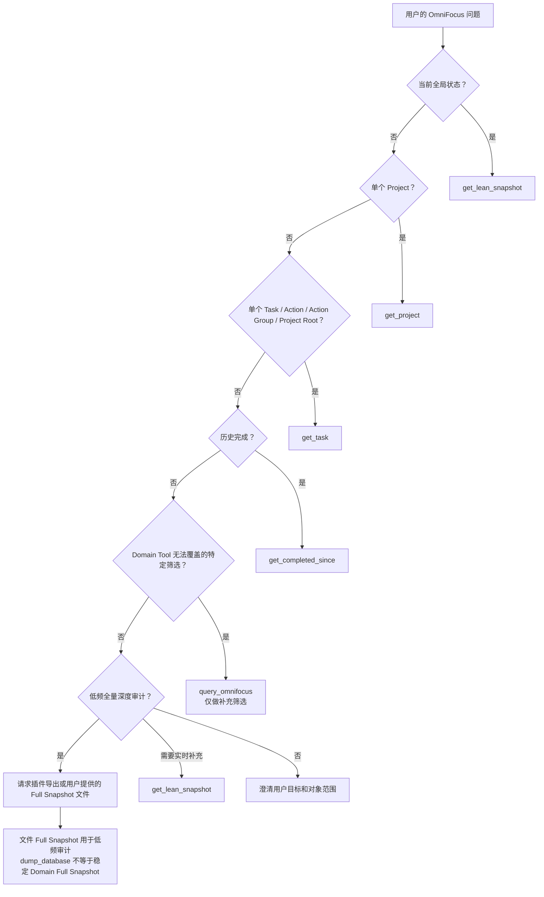

# GPT Tool Usage Guide

该文档是 GPT / AI Agent 的工具选择与调用编排指南。

它不替代：

- `README.md`：项目定位和架构概览。
- `docs/Architecture_Audit.md`：当前代码架构审计。
- `docs/architecture/decisions/`：已接受的设计决策。
- Tool schema：参数和返回类型的最终代码定义。

本指南回答：当用户提出某类 OmniFocus 分析问题时，GPT 应调用哪个 Tool、是否需要继续下钻，以及如何区分事实、语义和推断。

## Validation Baseline

| 项目 | 审计基线 |
|---|---|
| Repository | `GlassyWorld/Omnifocus-Agent-MCP`（`https://github.com/GlassyWorld/Omnifocus-Agent-MCP`） |
| Code baseline | `9a01036d0c8cf8570d98d50e8456612a5e0d2df7`（`main`） |
| Architecture label | `v1.0-personalized` |

本指南中的 Tool surface、Domain Contract 和语义规则均以该 code baseline 为验证对象。Architecture label 是个人化架构版本标识，不替代 `package.json` 中的 upstream package version `1.9.2`。

---

## Deployment Profiles

ChatGPT Web / iPhone Developer App 与 Secure MCP Tunnel 使用：

```text
OMNIFOCUS_MCP_PROFILE=personal-readonly
```

开发与 upstream compatibility 使用：

```text
OMNIFOCUS_MCP_PROFILE=upstream-full
```

未设置或设置为空时保持 `upstream-full`。本指南对 generic tools、mutation tools 和
Resources 的分类描述的是仓库完整 surface；在 `personal-readonly` 中，这些能力不会被
Server 注册。该限制是 Server-side enforcement，不是客户端 allowlist。当前 Profile
不支持写入；未来显式写入应使用独立 Profile 或新的 Accepted ADR，不得把写入能力重新
加入 `personal-readonly`。

---

## 1. Purpose and Scope

本指南服务于 GPT 对个人 OmniFocus 系统的读取、分析、总结和维护辅助。默认工作目标是：

- 读取 OmniFocus 中已存在的事实。
- 使用 Domain semantics 理解事实来源与对象关系。
- 总结当前状态或历史完成记录。
- 基于事实提出明确标注的分析推断与建议。

Domain Tool 提供稳定事实视图，不直接给出最终判断。AI 可以解释和归纳，但用户保留最终决策权。

自动写入不属于默认分析流程。分析结果不得自动触发 Task/Project 的创建、编辑、移动、完成或删除。

当前个性化核心 Tool 为：

1. `get_lean_snapshot`
2. `get_project`
3. `get_task`
4. `get_completed_since`

这四个 Domain read tools 应优先于 upstream generic interfaces。它们采用固定 Raw fields、strict Adapter 和稳定 Domain Contract，适合 GPT 进行一致分析。

基本原则：

> Use the smallest sufficient tool set.

先取得回答问题所需的最小充分信息；仅当结果不足时，才选择性下钻。

---

## 2. Tool Surface Classification

`upstream-full` 实际注册 16 个 Tool。`personal-readonly` 只注册四个 Personalized
Domain Read Tools，并且不注册 Resources。

### A. Personalized Domain Read Tools

| Tool | 核心用途 | 适合的问题 | 不适合的问题 | 典型后续调用 |
|---|---|---|---|---|
| `get_lean_snapshot` | 当前全系统 compact Domain View | 全局状态、Active/Planned/Deadline Projects、Attention、Inbox | 完成历史、完整数据库审计、全部 Task 详情 | 少量 `get_project`、`get_task` |
| `get_project` | 单 Project aggregate | Project status、Folder、kind、Due/Defer provenance、Task aggregate | 每个 Task 的完整详情、Project 健康度结论 | 选择性 `get_task` |
| `get_task` | 单个 Task-shaped object 的 Domain View | Action、Action Group、Project root、日期来源、层级、note、tags | 全局扫描、Action-only API、批量展开 | 通常无需；必要时关联 `get_project` |
| `get_completed_since` | direct completion event stream | 周/月回顾、最近完成、完成节奏 | 当前状态、当前已完成对象清单、Project root completion | `get_project`、`get_lean_snapshot` |

这些 Tool 返回的是 AI-facing Domain View，不是简单 Raw query。

### B. Generic Read Tools

#### 实际注册的 generic read tools

- `query_omnifocus`
- `dump_database`
- `list_perspectives`
- `get_perspective_view`
- `list_tags`

它们用于补充 Domain Tool 无法表达的查询：

- 按 Tag、Folder、Perspective 或通用 status/date 条件筛选。
- 查找不明确名称的候选对象。
- 用户明确要求某个特定通用筛选。
- 发现可用 Perspective 或 Tag。

它们不应替代 Domain Tool，原因包括：

- `query_omnifocus` handler 返回面向阅读的格式化文本，不是稳定 Domain JSON Contract。
- 通用 query 不负责 TaskKind、direct-owner Attention 或 Snapshot section semantics。
- `dump_database` 是全量报告，不是 Full Snapshot Domain read model。
- Perspective/Tag Tool 表达 OmniFocus 原生视图或目录，不提供个性化 Domain semantics。

#### MCP Resources

Server 还注册了 6 个 MCP Resources，它们不是 Tool：

- `omnifocus://inbox`
- `omnifocus://today`
- `omnifocus://flagged`
- `omnifocus://stats`
- `omnifocus://project/{name}`
- `omnifocus://perspective/{name}`

Resource 可以作为补充上下文，但不能视为四个 Domain Tool 的替代接口。

### C. Mutation Tools

`src/server.ts` 实际注册以下 mutation tools：

- `add_omnifocus_task`
- `add_project`
- `remove_item`
- `edit_item`
- `batch_add_items`
- `batch_remove_items`
- `create_tag`

这些 Tool：

- 仍存在于 upstream-compatible Server。
- 只在 `upstream-full` 注册，在 `personal-readonly` 中不可发现、不可调用。
- 不属于默认分析流程。
- 不得因为 Snapshot、Attention、推断或建议而自动触发。
- 只有用户明确提出具体写入请求时，才可视为新的 mutation request，进入独立的授权与确认流程。

`personal-readonly` 是已实现的 Server-side read-only boundary。本指南仍不定义 write
profile；完整模式保留 upstream compatibility，但分析或建议不构成 mutation authorization。

---

## 3. Default Tool Routing

默认路由：

```text
用户询问整个 OmniFocus 当前状态
    -> get_lean_snapshot

用户询问某个具体 Project
    -> get_project

用户询问某个具体 Action / Action Group / Project Root
    -> get_task

用户询问过去一段时间完成了什么
    -> get_completed_since

用户要求 Domain Tool 无法表达的特定筛选
    -> query_omnifocus

用户要求低频全量深度审计
    -> 优先请求插件或文件导出的 Full Snapshot
    -> 可补充 get_lean_snapshot 获取实时 current-state
```

调用规则：

1. 不要为了“更完整”而一开始调用所有 Tool。
2. 先使用与问题范围一致的最小 Tool。
3. 只有首轮结果不能支持回答时才下钻。
4. 下钻必须选择性进行，不批量展开全部 Project 或 Task。
5. 当前状态、对象详情和历史完成应使用各自的 Domain read model，不相互猜测。

---

## 4. Routing Decision Tree



Accepted ADR-004 明确：Full Snapshot 不要求成为 MCP Tool。当前低频深度审计继续使用插件或文件导出；只有真实、重复的个人需求出现后才重新评估开发。

---

## 5. Tool-by-Tool Usage Rules

### `get_lean_snapshot`

#### 适合

- 全局状态扫描。
- 当前关注项分析。
- Active Projects。
- 已到达的 direct Planned Project owners。
- Project-level direct Deadline owners。
- Task Attention。
- Inbox 当前状态。

输入只有可选 `limitPerSection`：默认 `25`，必须是 `1..100` 的整数。限制分别作用于 active、planned、deadline、attention 和 inbox sections。

#### 不适合

- 完成历史。
- Project 全部 Task 的详细内容。
- 将 health、risk、priority 当作已存事实。
- 完整数据库审计。
- note 全文读取；Snapshot 只提供 `hasNote`。

#### 下钻规则

```text
Snapshot 发现需要关注的 Project
    -> get_project

Snapshot 中具体 Task 的原因需要解释
    -> get_task
```

#### 必须理解的语义

- Project 可以同时出现在 `projects.active`、`projects.planned`、`projects.deadline`。
- Task 可以同时出现在 `attention` 和 `inbox`。
- 一个 Attention item 可以有多个 `reasons`，固定类别为 `overdue`、`dueSoon`、`planned`、`flagged`。
- inherited Planned/Due 保留为日期事实，但不产生独立 Planned/Due Attention。
- Project root 不作为 Task Attention 或 Inbox item 出现。
- `flagged` reason 使用 effective flagged fact；它与 Planned/Due 的 direct-owner gate 不同。
- Snapshot 中的事实不是 AI 对优先级、风险或健康度的结论。
- `truncated: true` 表示该 section 的 `items` 不完整；`total` 是截断前数量。

### `get_project`

#### 适合

- Project native status 与稳定 status booleans。
- Folder context。
- Project kind：`standard` 或 `single_actions`。
- Due/Defer 的 direct、effective、source。
- direct Task IDs、全部 descendant Task IDs。
- Task 总数与 native-status aggregate。
- 选择性 Project 分析。

输入必须是 exact canonical `id` 或区分大小写的 exact `name`，二选一。

#### 不适合

- 自动取得所有 Task 的完整 `TaskView`。
- 替代 `get_task`。
- 仅凭 aggregate count 判断 Project 健康、停滞或风险。

#### Canonical ID

```text
canonical Project ID = project.task.id.primaryKey
```

该 ID 同时是 Project root Task ID。因此：

- `get_project({id})` 返回 Project aggregate。
- `get_task({id})` 可以返回同一 Project 的 `project_root` Task facts。

二者是互补 View，不是重复接口。

### `get_task`

#### 适合

- `action`
- `action_group`
- `project_root`
- Due、Planned、Defer 来源。
- hierarchy。
- note、tags、repetition、estimate。
- native `taskStatus`。
- completion、drop、flag provenance。

输入必须是 exact `id` 或区分大小写的 exact `name`，二选一。Tool 可以读取当前数据库中仍可定位的 completed 或 dropped Task，并返回该对象当前的 Domain View，但不提供对象的历史版本或状态变更记录，也不能替代 completion event stream。

#### 边界

- `get_task` 不是 `get_action`。
- 调用方必须检查 `task.kind`。
- Action 当前是 Task Domain subtype，不是独立 Domain。
- `Owner` 只是从 direct provenance 推导的语义角色，不是 Domain entity。

### `get_completed_since`

#### 适合

- 周回顾、月回顾。
- 最近完成事项。
- 完成节奏分析。
- Review Workflow 的事实输入。

输入：

```json
{
  "since": "带 Z 或明确 UTC offset 的完整 ISO 8601 datetime",
  "until": "可选；同格式，缺省为当前时间"
}
```

规则：

- 使用 direct `completionDate`。
- `[since, until]` 是闭区间。
- 输入规范化为 UTC。
- 结果按 `completionDate` 降序。
- Project root completion 被排除。
- Action Group completion 被保留。
- 空区间结果是正常 success。
- 返回的是 completion events，不是当前已完成对象列表。
- 不通过 `modificationDate`、current status 或 `effectiveCompletedDate` 推断历史完成。

### `query_omnifocus`

仅在以下情形使用：

- 四个 Domain Tool 无法表达的特定过滤。
- Tag、Folder、Perspective 之外的通用 Task/Project/Folder query 需求。
- 用户明确要求某个 status/date/name/filter 组合。
- exact name 歧义时，使用只读字段缩小候选范围。

不要：

- 将它作为全局分析默认入口。
- 用它重新实现 Lean Snapshot。
- 用 generic query 重新推导 direct-owner semantics。
- 把格式化文本输出当作稳定 Domain Contract。

使用时应指定必要 `fields` 和合理 `limit`，避免无边界结果。Tag filter 是区分大小写的 exact match；多个 filters 使用 AND，数组内使用 OR。

### `dump_database`

- 不是个性化 Full Snapshot。
- 不是日常 GPT 分析入口。
- 可能包含过多上下文和弱语义数据。
- 不提供 direct-owner、TaskKind 或 Lean Snapshot section Contract。
- 仅在用户明确要求、低频且受控的全量检查场景中考虑。

当前低频 Full Snapshot workflow 优先使用插件或文件导出。`dump_database` 即使作为某次手动导出的来源，也不因此成为 Full Snapshot Domain Tool。

---

## 6. Multi-Tool Workflows

### Workflow A：当前系统扫描

1. 调用 `get_lean_snapshot`。
2. 先总结确认事实：section totals、items、reasons、dates、status。
3. 标记真正需要下钻的少量对象。
4. 对少量 Project 调用 `get_project`；对少量 Task 调用 `get_task`。
5. 将最终输出拆分为“已确认事实 / AI 推断 / 建议”。

不要对每个 Project 或 Task 自动下钻。

### Workflow B：单 Project 分析

1. 使用 canonical ID 或 exact name 调用 `get_project`。
2. 判断 Project aggregate 是否足以回答问题。
3. 只有需要解释具体日期、层级或 Task 状态时，才对少量关键 Task 调用 `get_task`。
4. 不默认展开 `tasks.allIds` 中的全部对象。

### Workflow C：周回顾

1. 计算用户时区下明确的 `since` 和 `until`，调用 `get_completed_since`。
2. 按 Project、`kind`、完成时间进行归纳。
3. 必要时调用少量 `get_project` 补充当前 Project 状态。
4. 可结合 `get_lean_snapshot` 对比“过去完成”和“当前状态”。
5. 不用 current Task status 替代 completion event。

### Workflow D：Inbox 整理分析

1. 调用 `get_lean_snapshot`。
2. 读取 `inbox` section，并检查 `truncated`。
3. 对少量 note、日期或层级不明确的 Task 调用 `get_task`。
4. 给出分类或澄清建议，标明这是 Recommendation。
5. 不自动移动、修改或创建对象。

### Workflow E：深度系统审计

1. 优先请求用户提供插件导出的 Full Snapshot 文件或其他明确的手动导出 artifact。
2. 使用文件 Full Snapshot 进行低频、全量、跨对象深度审计。
3. 如需当前实时补充，调用 `get_lean_snapshot`。
4. 对极少数关键对象使用 `get_project` / `get_task` 验证。
5. 不为了深度审计而无限扩张 Lean Snapshot，也不默认调用 `dump_database`。

职责区分：

```text
MCP Lean Snapshot
    -> 实时 current-state

文件 Full Snapshot
    -> 低频深度审计
```

---

## 7. Fact, Semantic Fact, Inference, Recommendation

GPT 输出必须区分四层内容。

### OmniFocus Raw Fact

直接来自 OmniFocus 或固定 Raw mapping 的事实，例如：

- native `taskStatus`
- direct Due
- effective Planned
- Folder
- Tag
- `completionDate`

### Domain Semantic Fact

由已接受 Domain rule 对 Raw facts 进行稳定解释，例如：

- `source = inherited`
- `kind = action_group`
- Project 是 direct deadline owner
- Attention reason 为 `planned`
- Project root 与 canonical Project ID 的关系

### AI Inference

AI 基于多个事实得出的分析，例如：

- Project 可能停滞。
- Inbox 可能积压。
- 某类 Task 近期推进较少。
- 当前 Attention 可能过度集中在某个 Project。

Inference 不是 OmniFocus 已存事实，必须使用“可能、显示出、值得检查”等表述，并说明证据。

### Recommendation

面向用户的建议动作，例如：

- 建议明确下一步 Action。
- 建议检查或调整 Project status。
- 建议补充 note、Due 或 Planned date。
- 建议确认某个 inherited date 是否符合管理意图。

推荐回答结构：

```text
已确认事实
- ...

分析推断
- ...（依据：...）

建议动作
- ...
```

不得把 AI inference 或 recommendation 写成 OmniFocus 已存事实。

---

## 8. Error and Ambiguity Handling

### Exact name 返回多个对象

`get_task` / `get_project` 返回 `ambiguous_match` 时：

- 不任意选择。
- 使用 `query_omnifocus` 进行只读候选查询，返回最少必要字段，如 ID、name、Project/Folder context。
- 将候选项交给用户确认后，再使用 ID 调用 Domain Tool。

### 对象不存在

`not_found` 表示没有 exact match。不要猜测 ID，也不要把 partial name 自动当成目标对象。可以询问用户，或使用通用只读查询缩小范围。

### Domain contract failure

Adapter、Project/root join、Due consistency 或 composer invariant failure 会通过 Domain Tool 的 `query_failed` 返回。当前代码没有独立 `domain_contract_failure` error code，应根据错误消息说明这是 Contract/Adapter 失败，而不是伪造部分结果。

### Snapshot truncated

任何 section 的 `truncated: true` 都意味着 `items` 不完整：

- 明确告诉用户当前只显示 `returned / total`。
- 不把返回 items 解释为完整集合。
- 可以在 `1..100` 范围内有理由地提高 `limitPerSection`，但不要为了保险无条件设为最大值。

### 用户名称不明确

- 不猜测大小写、Project、Folder 或 parent context。
- 优先请求 ID 或更完整名称。
- 必要时使用 `query_omnifocus` 做只读候选发现。

### 时间区间缺失

`get_completed_since` 的 `since` 必填。若用户只说“最近”而未给范围，应先澄清；若说“过去 7 天”，应按用户时区计算完整 ISO datetime。为可复现性，Review workflow 宜显式提供 `until`。

### Tool 返回信息不足

只选择与缺失信息对应的 follow-up Tool。不要因一个字段缺失就调用整个工具链。

### 错误类别

| 类别 | 当前表现 | GPT 处理 |
|---|---|---|
| 参数错误 | `invalid_arguments` | 修正参数或向用户澄清 |
| 未找到 | `not_found` | 不猜测；确认名称/ID |
| 多结果 | `ambiguous_match` | 查询候选并请求确认 |
| Domain Contract/Adapter failure | 通常映射为 `query_failed` | 明确报告 Contract failure，不返回伪造数据 |
| OmniFocus/bridge execution failure | 通常映射为 `query_failed` | 说明读取失败；不要解释为“没有数据” |

`get_completed_since` 空结果是 success，不是 `not_found`。`get_lean_snapshot` 也没有单对象 `not_found` 或 `ambiguous_match` 语义。

---

## 9. Anti-Patterns

### 一开始调用 `dump_database`

过度获取上下文，且缺少稳定 Domain semantics。全局当前状态应先用 `get_lean_snapshot`。

### 对每个 Project 批量调用 `get_project`

会形成 N+1 调用和无边界上下文。先看 Snapshot，再选择少量 Project。

### 对每个 Task 批量调用 `get_task`

会把 compact View 重新膨胀为全库详情。仅解释关键对象。

### 用 effective Due/Planned 重新生成 Attention

违反 direct-owner ADR，会重新制造 inherited child fan-out。

### 将 Action 当作独立 Domain

当前 Action 是 `TaskKind` subtype；不存在 `ActionView` 或 `get_action`。

### 将 Owner 当作独立实体

Owner 是从 direct provenance 推导的语义角色，不是 persisted object 或 `OwnerView`。

### 把 Project aggregate 当作完整 Task 详情

`ProjectView.tasks` 提供 ID 和 count，不提供每个 Task 的完整 `TaskView`。

### 把 Completion event 当作 current status

`CompletedTaskView` 表达历史 direct completion event，不是对象当前全量状态。

### 把 AI recommendation 当作 Domain fact

建议必须单独标注，不能伪装成 OmniFocus 已存字段或已接受 semantics。

### 未经明确请求调用 mutation Tool

分析完成不构成写入授权。写入必须是新的明确请求并进入独立流程。

### 为简单问题调用整个工具链

违反最小充分工具集原则，增加延迟、上下文和误读风险。

### 忽略 `truncated`、`source`、`kind` 或 native status

会把部分结果当全集、继承值当 owner、Task subtype 混淆，或脱离 OmniFocus 状态边界进行推断。

---

## 10. Prompt-to-Tool Examples

### “分析一下我现在 OmniFocus 的整体状态”

- 首选 Tool：`get_lean_snapshot`。
- Follow-up：只对少量关键 Project/Task 使用 `get_project` / `get_task`。
- 不应调用：`dump_database`、mutation tools、全部对象详情链。
- 输出：Snapshot 提供事实；GPT 另行标注推断与建议。

### “看看 N322 项目现在是什么情况”

- 首选 Tool：`get_project`，优先使用已知 canonical ID；只有名称时使用 exact `name`。
- Follow-up：必要时对少量关键 Task 调用 `get_task`。
- 不应调用：全局 Snapshot 作为默认入口、项目内全部 Task 批量下钻。
- 输出：ProjectView 是 Domain facts；健康/停滞判断是 AI inference。

### “为什么‘等待结构件返回’没有进入 Attention”

- 首选 Tool：`get_task({"name":"等待结构件返回"})`，名称必须 exact、区分大小写。
- Follow-up：检查 `kind`、Planned/Due `source`、native `taskStatus`、hierarchy；若名称歧义，先查询候选。
- 不应调用：自行用 effective date 重算 Attention。
- 输出：日期和状态是事实；“因为 inherited 所以不触发 direct-owner Attention”是 Domain semantic explanation。

### “总结过去 7 天完成了什么”

- 首选 Tool：`get_completed_since`。
- Follow-up：必要时用 `get_project` 补充当前 Project context，或用 Snapshot 对比当前状态。
- 不应调用：current Task status 查询来推导历史完成。
- 输出：completion events 是事实；按 Project/类型归纳是分析。

### “有哪些带某个 Tag 的任务”

- 首选 Tool：`query_omnifocus`，因为四个 Domain Tool 不提供 Tag 集合筛选。
- 推荐最小调用：`entity: "tasks"`、`filters.tags: ["准确Tag名"]`、有限 `fields` 和合理 `limit`。
- Follow-up：只有需要单对象 provenance 时才用 `get_task`。
- 不应调用：`dump_database`。
- 输出：query matches 是通用读取结果，不是稳定 TaskView 集合。

### “对整个系统做一次深度季度审计”

- 首选输入：请求插件导出的 Full Snapshot 文件或用户提供的手动导出 artifact。
- Follow-up：可调用 `get_lean_snapshot` 获取实时 current-state；只对关键对象下钻。
- 不应调用：默认 `dump_database`，或无限扩张 Lean Snapshot。
- 输出：文件内容是审计事实输入；跨对象趋势与问题判断是 AI inference。

---

## 11. Minimal Invocation Principle

> Use the smallest sufficient tool set.

具体规则：

- 单对象问题不调用全局 Snapshot。
- 全局问题先调用 Lean Snapshot。
- 历史问题不通过 current-state Tool 推断。
- 通用筛选问题才使用 `query_omnifocus`。
- Full Snapshot 低频审计继续使用文件通道。
- 不为了“保险”而调用所有 Tool。
- 一个 Tool 已足够回答时停止下钻。
- Follow-up 必须对应明确缺失的信息。

---

## 12. GPT Integration Acceptance Scenarios

### Scenario 1：Global state

用户：

> 分析我的 OmniFocus 当前状态，并告诉我最需要关注的三个问题。

预期：

- 首先调用 `get_lean_snapshot`。
- 不直接调用 mutation tools。
- 检查各 section 的 `truncated`。
- 输出明确区分事实、推断和建议。
- “最需要关注”被标注为 AI inference，不声称是 OmniFocus priority fact。

### Scenario 2：Project drill-down

用户：

> 分析 N322 项目。

预期：

- 调用 `get_project`。
- 只有现有 aggregate 不足时才调用少量 `get_task`。
- 不自动展开全部 Task IDs。
- 不仅凭 status counts 宣称 Project 健康或停滞。

### Scenario 3：Completion review

用户：

> 回顾过去 7 天完成事项。

预期：

- 调用 `get_completed_since`。
- 使用用户时区计算带 `Z` 或 explicit UTC offset 的 ISO datetime。
- 使用 direct completion events。
- 不用 current Task status 或 `modificationDate` 替代 completion event。

### Scenario 4：Ambiguous object

用户给出一个重复的 exact name。

预期：

- 不任意选择对象。
- 明确说明 `ambiguous_match`。
- 请求用户确认，或使用允许的只读 query 返回候选 ID/context。
- 用户确认后按 ID 调用 Domain Tool。

### Scenario 5：Explicit write request

用户：

> 把刚才建议的任务写入 OmniFocus。

预期：

- 不因为前一步分析而自动写入。
- 将其识别为新的显式 mutation request。
- 进入未来独立授权、预览和确认流程。
- 当前指南不自行执行或设计该 write workflow。

---

## 13. Maintenance Rules

以下情况发生时必须更新本指南：

- 新增或删除个性化 Domain Tool。
- Tool schema、响应或错误 Contract 变化。
- Lean Snapshot section、ownership 或 Attention semantics 变化。
- 新 ADR 替代现有决策。
- GPT 接入方式或默认 routing 确定。
- read-only / write profile 正式实现。
- Full Snapshot workflow 从手动文件通道转为其他模式。
- Generic Tool 或 Resource surface 变化。

更新优先级：

```text
真实代码与测试
    >
Accepted ADR
    >
README / Architecture Audit
    >
本 Tool Usage Guide
```

当文档与代码不一致时：

1. 不得静默改变语义。
2. 先报告差异及影响。
3. 以真实代码和测试描述当前行为。
4. 若差异涉及已接受决策，应单独评审代码或 ADR，而不是在本指南中自行发明新规则。

### 当前文档一致性与实现边界

本次文档校准已完成：

- `QUERY_TOOL_REFERENCE.md` 和 `QUERY_TOOL_EXAMPLES.md` 已按当前代码更新，明确
  `deferredUntil` 已实现，并记录 `dueWithin`、`plannedWithin`、`deferredUntil` 只有
  upper bound 等实际限制。
- `PERSONALIZATION.md` 已与 Accepted ADR-004 对齐：当前低频 Full Snapshot 需求使用
  手动/plugin/file 导出 + AI 分析，暂缓 Full Snapshot MCP，直到出现明确且重复的个人
  需求。
- 当前 README、Architecture Audit、Accepted ADR、Query 文档、`PERSONALIZATION.md` 与
  本指南在个性化 Domain Tool、direct-owner semantics 和 Full Snapshot 边界上没有已知
  核心冲突。

仍需保留的实现边界：

1. `package.json` 和 MCP Server 报告的版本仍为 upstream `1.9.2`；
   `v1.0-personalized` 是文档与架构 release label，不是当前 package version。
2. Domain Tool 的 Adapter/Contract failure 与 OmniFocus/bridge execution failure 最终都
   可能映射为 `query_failed`；当前不存在分别命名的公开 error code，GPT 必须结合错误
   消息区分。
3. `upstream-full` 仍注册 7 个 mutation tools；`personal-readonly` 在 Server registration
   层不注册它们，也不注册 generic read tools 或 Resources。
